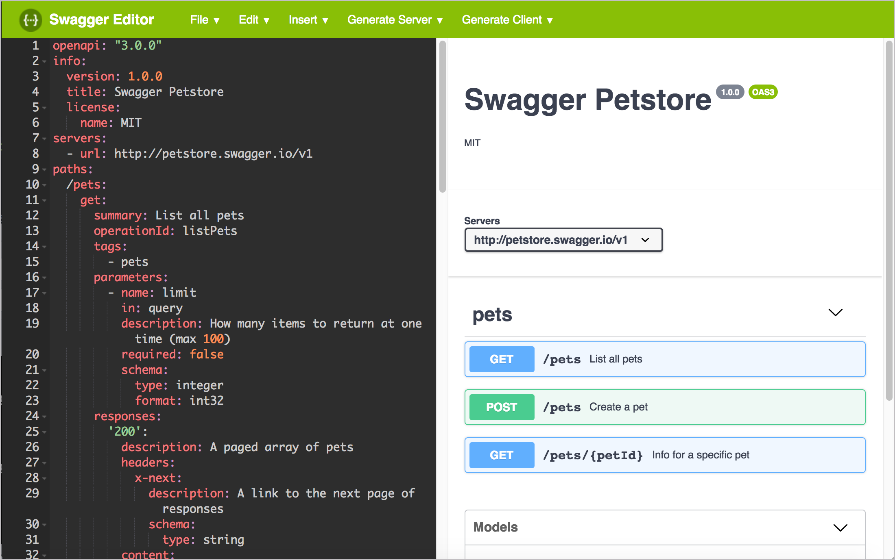
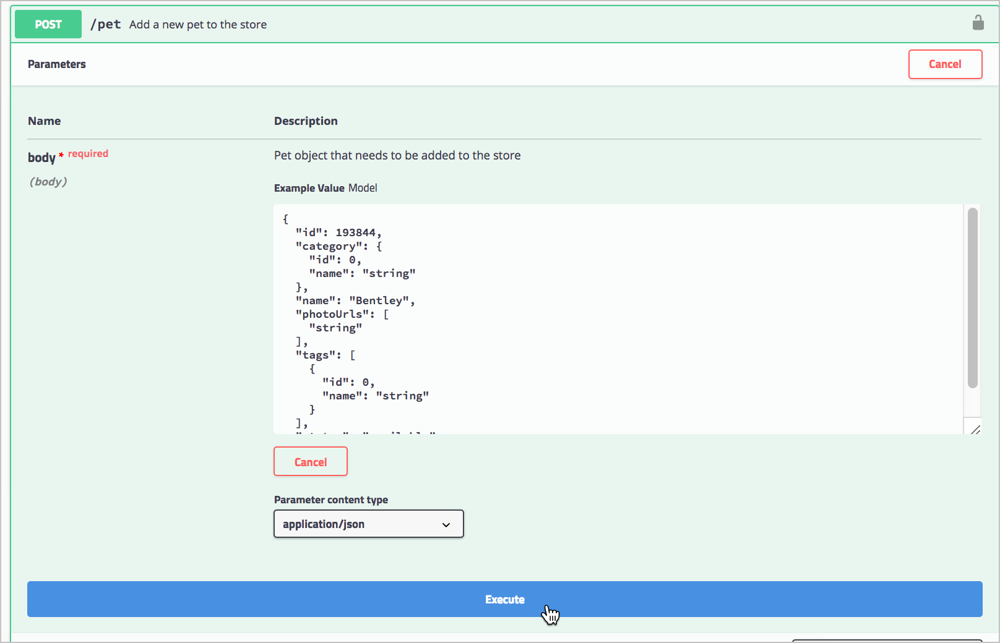

# Знайомство зі специфікаціями OpenAPI і Swagger
OpenAPI є специфікацією для опису REST API. Можна розглядати специфікацію OpenAPI як специфікацію DITA. У DITA існують певні елементи XML, які використовуються для визначення компонентів довідки, а також необхідний порядок і ієрархія для цих елементів. Різні інструменти можуть читати DITA і створювати веб-сайт документації на основі інформації.

У OpenAPI замість XML існує набір об'єктів JSON з певною схемою, яка визначає їх найменування, порядок і вміст. Цей файл JSON (часто виражається в YAML замість JSON) описує кожну частину API. Описуючи API в стандартному форматі, інструменти публікації можуть програмно аналізувати інформацію про API і відображати кожен компонент в стилізованому інтерактивному вигляді.


## Погляд на специфікацію OpenAPI

Щоб краще зрозуміти специфікацію OpenAPI, давайте поглянемо на деякі витяги з специфікації. Заглибимося в кожен елемент в наступних розділах.

Елементи OpenAPI - це `paths`,` parameters`, `responses` і` security`. Кожен з цих елементів є об'єктом JSON, який містить властивості та масиви.

У специфікації OpenAPI ваші кінцеві точки це `paths`. Кінцева точка `/ pet`, в специфікації OpenAPI може виглядати наступним чином:

    paths:
        /pets:
            get:
                summary: List all pets
                operationId: listPets
                tags:
                    - pets
                parameters:
                    - name: limit
                    in: query
                    description: How many items to return at one time (max 100)
                    required: false
                    schema:
                        type: integer
                        format: int32
                responses:
                    '200':
                    description: An paged array of pets
                    headers:
                        x-next:
                            description: A link to the next page of responses
                            schema:
                                type: string
                    content:
                        application/json:    
                            schema:
                                $ref: "#/components/schemas/Pets"
                default:
                    description: unexpected error
                    content:
                        application/json:
                            schema:
                                $ref: "#/components/schemas/Error"

Це формат YAML, взятий з [Swagger PetStore](http://petstore.swagger.io/)

Ось що значать об'єкти в цьому коді:

- `/ pets` - кінцева точка path;
- `get` - HTTP метод;
- `parameters` - список параметрів кінцевої точки;
- `responses` - список відповідей на запит
- `200` - HTTP код статусу
- `$ ref` є посиланням на іншу частину реалізації, де визначається відповідь (в` components`). OpenAPI має багато `$ ref` посилань, подібних до цієї, щоб зберегти код в чистоті і полегшити його повторне використання.


## Перевірка специфікації

При створенні специфікації OpenAPI, замість того, щоб працювати в текстовому редакторі, можна написати свій код в [редакторі Swagger](http://editor.swagger.io/). Редактор Swagger динамічно перевіряє контент, щоб визначити, чи є створена специфікація валидной.



Якщо допустити помилку при написанні коду в редакторі Swagger, можна швидко виправити її, перш ніж продовжити, замість того, щоб чекати запуску збірки і усувати помилки.

Для формату специфікації у нас є вибір роботи JSON або YAML. Приклад коду вище знаходиться в [YAML](https://yaml.org/). У YAML офіційне визначення: «YAML не є мовою розмітки», що означає, що в YAML немає тегів розмітки (<>), як в інших мовах розмітки, таких як XML.

YAML залежимо від прогалин і двокрапок, що встановлюють синтаксис об'єкта. Таке просторово-чутливе форматування робить код більш зрозумілим для людей. Однак, іноді можуть виникнути складності з розстановкою правильних інтервалів.

## Автоматична генерація файлу OpenAPI з анотацій коду

Замість того, щоб кодувати документ в специфікації OpenAPI вручну, також можна автоматично згенерувати його з анотацій в програмному коді. Цей підхід, орієнтований на розробників, має сенс, якщо є велика кількість API-інтерфейсів або якщо для технічних письменників недоцільно створювати цю документацію.

Swagger пропонує безліч бібліотек, які можна додавати в свій програмний код для створення документа в специфікації. Ці бібліотеки Swagger аналізують анотації, які додають розробники, і генерують документ в специфікації OpenAPI. Ці бібліотеки вважаються частиною проекту [Swagger Codegen](https://swagger.io/tools/swagger-codegen/). Методи анотації розрізняються залежно від мови програмування. 

Хоча цей підхід і «автоматизує» генерацію специфікації, потрібно ще розуміти, які анотації додати і як їх додати (цей процес не занадто відрізняється від коментарів і анотацій Javadoc). Потім потрібно написати контент для кожного із значень анотації (описуючи кінцеву точку, параметри і т. Д.).

Коротше кажучи, попрацювати все потрібно - автоматизована частина змушує бібліотеки Codegen генерувати визначення моделі і дійсний документ, який відповідає схемі OpenAPI. Проте, багато розробників схвильовані цим підходом, тому що він пропонує спосіб генерувати документацію з анотацій коду, що розробники роками робили з іншими мовами програмування, такими як Java (використовуючи [Javadoc](https://www.oracle.com/technetwork /articles/java/index-137868.html)) або C ++ (використовуючи [Doxygen](http://www.doxygen.nl/)). Вони зазвичай вважають, що генерація документації з коду призводить до меншого відхилення документації. Документи, залишатимуться актуальними, якщо будуть тісно пов'язаний з кодом.

Якщо йти цим шляхом, потрібно переконатися, що є доступ до вихідного коду для внесення змін в анотації. В іншому випадку розробники будуть писати документацію (що може і добре, але часто призводить до поганих результатів).

## Підхід: розробка по специфікації

Можна згенерувати свою специфікацію з анотацій коду, але кажуть, що автоматична генерація - не найкращий підхід. [Майкл Стоу (Michael Stowe)](https://twitter.com/mikegstowe) в статті [Безперешкодний REST: керівництво з проектування Perfect API](https://www.mulesoft.com/lp/ebook/api/restbook) рекомендує групам вручну реалізувати специфікацію, а потім обробляти документ специфікації як документ, який розробники використовують при виконанні реального кодування. Цей підхід часто згадується як «spec-first development».


* Spec-first development це філософія про те, як розробляти API більш ефективно. Якщо ви прямуєте філософії «спочатку специфікація», ви спочатку пишете специфікацію і використовуєте її в якості контракту, до якого розробники пишуть код. *

Іншими словами, розробники звертаються до специфікації, щоб побачити, як повинні називатися імена параметрів, які повинні бути відповіді і так далі. Після того, як цей «контракт» або «план» був прийнятий, Стоу каже, можна помістити анотації до свого код (при бажанні), щоб згенерувати документ специфікації більш автоматизованим способом. Але не варто кодувати без попередньої специфікації.

Занадто часто команди розробників швидко переходять до кодування кінцевих точок API, параметрів і відповідей, без користувальницького тестування або дослідження, чи відповідає API того, що хочуть користувачі. Оскільки управління версіями API-інтерфейсів надзвичайно складно (необхідно підтримувати кожну нову версію в подальшому з повною зворотною сумісністю з попередніми версіями), є бажання уникнути підходу «швидкий збій», який так часто відзначають agile ентузіасти. Немає нічого гіршого, ніж випустити нову версію вашого API, яка робить недійсними кінцеві точки або параметри, які використовуються в попередніх випусках. Постійне Версіонування в API може стати кошмаром документації.

Компанія [Smartbear](https://smartbear.com/), яка робить SwaggerHub (платформу для спільної роботи команд над специфікаціями API Swagger), говорить, що тепер для команд частіше зустрічається ручне написання специфікації, а не вбудовування анотацій вихідного коду в програмний код для автоматичної генерації. Підхід "spec-first development" в першу чергу допомагає працювати документації серед більшої кількості членів команди, а не лише інженерів. Визначення специфікації перед кодуванням також допомагає командам створювати кращі API.

Навіть до створення API специфікація може генерувати помилковий відповідь, додаючи визначення відповіді в специфікацію. Мок-сервер генерує відповідь, який виглядає так, як ніби він виходить від реального сервера, але це просто зумовлений відповідь в коді, і здається динамічним для користувача.


## Роль технічного письменника в специфікації

У більшості проектів Тома Джонсона розробники були не дуже добре знайомі з Swagger або OpenAPI, тому він зазвичай створював документ специфікації OpenAPI вручну. Крім того, він часто не мав доступу до вихідного коду, і для розробників англійська мова була нерідною. Документація була для них складною справою.

Можливо, і нам будуть потрапляти інженери, які не знайомі з Swagger або OpenAPI, але зацікавлені у використанні їх в якості підходу до документації API (підхід, заснований на схемах, відповідає інженерного мислення). Таким чином, нам, ймовірно, доведеться взяти на себе ініціативу, щоб направляти інженерів до необхідної інформації, підходу і інших деталей, які відповідають кращим практикам для створення специфікації.

В цьому відношенні технічні письменники грають ключову роль у співпраці з командою в розробці специфікації API. Якщо дотримуватися філософії розробки, заснованої на специфікаціях, ця роль (техпісателя) може допомогти сформувати API до його кодування і блокування. Це означає, що може бути можливість впливати на імена кінцевих точок, консистенцію і шаблони, простоту і інші чинники, які впливають на розробку API (на які, як правило, не впливають технічні письменники).


## Візуалізація специфікації OpenAPI за допомогою Swagger UI

Після того, як вийшов чинний документ за специфікацією OpenAPI, що описує API, можна "згодувати" цю специфікацію різних інструментів, щоб проаналізувати його та згенерувати інтерактивну документацію, аналогічну [наприклад Petstore](http://petstore.swagger.io/).

Найбільш поширеним інструментом, використовуваним для аналізу специфікації OpenAPI, є [Swagger UI] (https://github.com/swagger-api/swagger-ui). (Пам'ятаєте, що «Swagger» відноситься до інструментів API, тоді як «OpenAPI» відноситься до незалежної від постачальника специфікації, що не залежить від інструменту.) Після завантаження призначеного для користувача інтерфейсу Swagger його досить легко налаштувати за допомогою власного файлу специфікації. 

Код призначеного для користувача інтерфейсу Swagger генерує екран, який виглядає наступним чином:


> На зображенні видно, як Swagger відображає специфікацію Open API


Деякі дизайнери критикують випадають списки Swagger UI як застарілі. У той же час розробники вважають, утворять єдиний модель привабливою і здатної зменшувати або збільшувати деталі. Об'єднуючи все кінцеві точки на одній сторінці в одному поданні, користувачі можуть відразу побачити весь API. Таке відображення дає користувачам уявлення в цілому, що допомагає зменшити складність і дозволяє їм почати. 

## Тестування: Досліджуємо API PetStore в Swagger UI

Давайте познайомимося з призначеним для користувача інтерфейсом Swagger, використовуючи Petstore.

1. Переходимо по посиланню [Swagger Pet Store Demo](https://petstore.swagger.io)

Як і в більшості заснованих на Swagger'е інструментів, в інтерфейсі Swagger є кнопка «Try it out». Для роботи необхідна авторизація в Swagger. Авторизація по натисканні на кнопку `Authorize`, у вікні потрібно вставити коректну інформацію. При бажанні авторизуватися можна додавши будь-який номер в поле `api_key` і натиснувши` Authorize`. Вікно авторизації Petstore призначене тільки для демонстрації, так що вікно можна просто закрити.


*Вікно авторизації в Swagger UI*

2. Розгорніть кінцеву точку **Pet**

3. Натискаємо на кнопку `Try it out`. Після натискання приклад значення в поле "Тіло запиту" стане редагується.


*Кнопка `Try it out` в Swagger UI*

4. У прикладі замінюємо значення `id` на інше ціле (не повторюється) число.
 Далі змінюємо значення `value` на яке-небудь люди знають (ім'я цуценя -` Puppy`).

5. Натискаємо `Execute`



*Виконання прикладу Petstore запиту*

Swagger UI відправляє запит і показує відправлений curl.
У прикладі був відправлений curl:

```js
curl -X POST "https://petstore.swagger.io/v2/pet" -H "accept: application/xml" -H "Content-Type: application/json" -d "{ \"id\": 1000, \"category\": { \"id\": 0, \"name\": \"string\" }, \"name\": \"Bentley\", \"photoUrls\": [ \"string\" ], \"tags\": [ { \"id\": 0, \"name\": \"string\" } ], \"status\": \"available\"}"
```
Зверніть увагу, що з параметром -d (data) параметр тіла запиту екранується і додається безпосередньо в команду curl, а не завантажується з файлу 

У розділі "Відповіді" Swagger UI видає відповідь сервера. За замовчуванням відповідь повертає XML:

```Xml
<? Xml version = "1.0" encoding = "UTF-8" standalone = "yes"?>
  <Pet>
    <Category>
      <Id> 0 </ id>
      <Name> string </ name>
    </ Category>
    <Id> 1000 </ id>
    <Name> Bentley </ name>
    <PhotoUrls>
      <PhotoUrl> string </ photoUrl>
    </ PhotoUrls>
    <Status> available </ status>
    <Tags>
      <Tag>
        <Id> 0 </ id>
        <Name> string </ name>
      </ Tag>
    </ Tags>
  </ Pet>
```

Якщо вибрати в списку, що випадає "Response content type" JSON, то у відповіді повернеться JSON замість XML.


6. "Petstore" - є чинним API, вихованець фактично створено. Для забави розгорнемо кінцеву точку GET / pet / {petId}, натискаємо `Try it out`, вводимо` id` вихованця, який використовували в попередньої операції, а потім виконуємо запит. У відповіді бачимо ім'я вихованця, яке збігається з тим, що ввели в попередньому прикладі.


## Кастомізація Swagger UI

Swagger UI можна налаштувати на свій, щоб висновок інформації не виглядав одноманітно: можна налаштувати кольору інтерфейсу Swagger, додати власний логотип, додати інших призначених для користувача стилів. Можна інтегрувати [Bootstrap](https://getbootstrap.com/), щоб отримати [модальні вікна](https://getbootstrap.com/docs/4.1/components/modal/), де користувачі можуть генерувати свої коди авторизації. Можна навіть додати функції згортання / розгортання в елементі `description`, щоб надати більше інформації користувачам.

Однак, крім цих простих модифікацій, буде потрібно трохи майстерності веб-розробника, щоб істотно змінити відображення призначеного для користувача інтерфейсу Swagger. Можливо, знадобляться навички веб-розробки.


## Недоліки OpenAPI і Swagger UI

Незважаючи на те, що Swagger володіє інтерактивними можливостями апелювати до бажань користувачів «дай мені спробувати», у Swagger і OpenAPI є деякі недоліки:

- **Інформація тільки про заслання**: По-перше, специфікація OpenAPI і вихідні дані Swagger UI охоплюють тільки документацію посилання. OpenAPI надає основу кожної кінцевої точки: опис, параметри, приклад запиту та відповіді. OpenAPI не містить місця для опису початку роботи, інформації про те, як отримати ключі API, як запустити приклад програми, інформацію про обмеження швидкості або про сотні інших деталей , які знаходяться в гайдах для розробників. Тому, незважаючи на те, що є цей крутий інтерактивний інструмент, що дозволяє користувачам досліджувати і вивчати наш API, ми все одно повинні надати керівництво користувача. За аналогією, висновок Javadoc для заснованої на бібліотеці API не навчить користувачів, як на насправді використовувати наш API. Нам все ще потрібно описати сценарії використання класу або методу, пояснити, як налаштувати код, що робити з відповіддю, як усунути неполадки і т. Д Коротше кажучи, писати реальні довідкові та покрокові керівництва.
- **Надмірність / дублювання інформації**: В OpenAPI потенційно є два місця, де описуються кінцеві точки і параметри (опис посилання Swagger UI і керівництво користувача), і потрібно або синхронізувати їх, вбудувати одне в інше, або іншим чином вказати зв'язок між ними. 
- **Складність робочого процесу API**: Складність API також може створити обмеження в Swagger. Пітер Грюнбаум, який опублікував кілька навчальних посібників з документування API для Udemy, каже, що автоматизовані інструменти, такі як Swagger, працюють краще за все для простих API. Якщо є кінцеві точки, які мають складні взаємозалежності і вимагають спеціальних робочих процесів настройки або інший не інтуїтивної обробки, простий характер пробного інтерфейсу Swagger може, ймовірно, змусити користувачів почухати голову. Наприклад, якщо потрібно спочатку налаштувати службу API, перш ніж кінцева точка що-небудь поверне, а потім використовувати одну кінцеву точку, щоб отримати певний об'єкт, який передається в параметри інший кінцевої точки, і т.д., функції `Try-it- out` в Swagger UI не матиме великого сенсу для користувачів без докладного керівництва.
- **Запити до реальних даних**: Деякі користувачі можуть не усвідомлювати, що натискання кнопки `Try-it-out` створює реальні виклики для їх власних облікових записів на основі використовуваних ними ключів API. Змішування використання дослідницької ізольованою програмного середовища, такий як Swagger, з реальними даними може згодом створити головні болі, коли користувачі почнуть запитувати, як можна видалити всі тестові дані або чому їх фактичні дані тепер зіпсовані. Для цих сценаріїв найкраще налаштувати пісочницю або тестову обліковий запис для користувачів. Але це легше сказати, ніж зробити. Можна виявити, що компанія не надає «пісочницю» для тестування API. Всі виклики API виконуються тільки для реальних даних.
- **Обмеження CORS**: Можна зіткнутися з обмеженнями CORS (Cross-Origin Resource Sharing - обмін ресурсами між джерелами) при виконанні викликів API. Не всі API приймають запити, виконані з веб-сторінки. Якщо виклики не виконуються, потрібно відкрити консоль JavaScript і перевірити, чи не блокує Чи CORS запит. Якщо це так, потрібно попросити розробників внести корективи, щоб врахувати запити, ініційовані з JavaScript на веб-сторінках. 
- **Проблематика великих параметрів тіла запиту**: кінцеві точки з довгими параметрами тіла запиту, як правило, проблематичні. Один API може включати запити з параметрами тіла запиту довжиною в сотні рядків (тіло запиту використовувалося для настройки сервера API). З таким параметром тіла запиту відображення призначеного для користувача інтерфейсу Swagger виявилося непридатним для використання. Команда повернулася до набагато більш примітивним підходам (таким як таблиці) для перерахування всіх параметрів і їх опису.


## Позитивні сторони

Незважаючи на недоліки специфікації OpenAPI, він все ж настійно рекомендується її для опису API. OpenAPI швидко стає засобом для все більшої і більшої кількості інструментів  для швидкого отримання інформації про наш API і для перетворення її в доступну і інтерактивну документацію. За допомогою своєї специфікації OpenAPI можна перенести свій API на багато платформи і системи, а також автоматично налаштовувати модульне тестування і створення прототипів.

Swagger UI забезпечує виразно хорошу візуальну форму для API. Можна легко побачити всі кінцеві точки і їх параметри .Грунтуючись на цій структурі, можна допомогти користувачам зрозуміти основи вашого API.

Крім того, вивчення специфікації OpenAPI і опис свого API з його об'єктами і властивостями допоможе розширити свій власний словник API. Наприклад, стане зрозуміло, що існує чотири основні типи параметрів: параметри «шляху», параметри «заголовка», параметри «запиту» і параметри «тіла запиту» . Типи даних параметрів в REST: «Boolean», «number», «integer» або «string». В відповідях містяться «objects», що містять «strings» або «arrays».

Коротше кажучи, реалізація специфікації дасть ще й уявлення про термінологію API, яка, в свою чергу, допоможе описати різні компоненти свого API достовірними способами.

OpenAPI може не підходити для кожного API, але якщо API має досить прості параметри, без великої кількості взаємозалежностей між кінцевими точками, і якщо немає проблем досліджувати API з даними користувача, OpenAPI і Swagger UI можуть бути потужним доповненням до документації. Можна давати користувачам можливість випробувати запити і відповіді.

З таким інтерактивним елементом документація стає більше, ніж просто інформація. За допомогою OpenAPI і Swagger UI ми створюємо простір для користувачів, які одночасно можуть читати нашу документацію і експериментувати з нашим API. Ця комбінація має тенденцію надавати потужний досвід навчання для користувачів.


