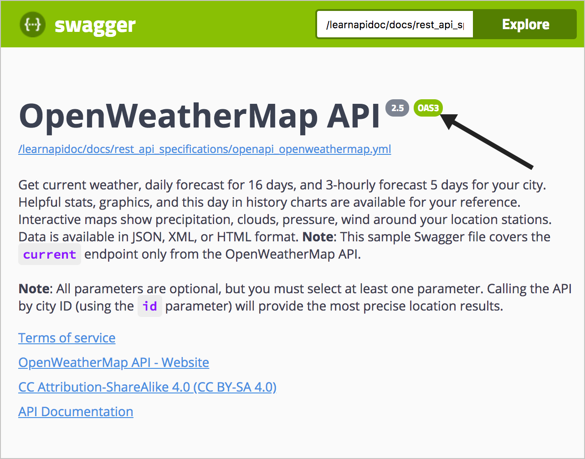
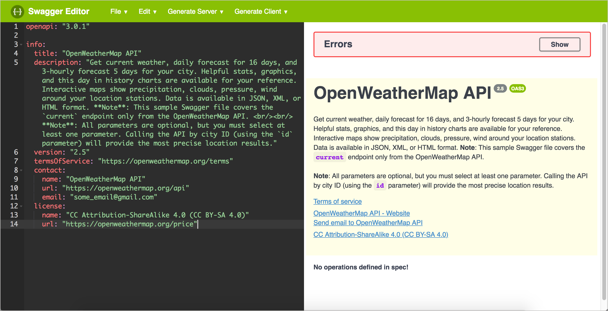
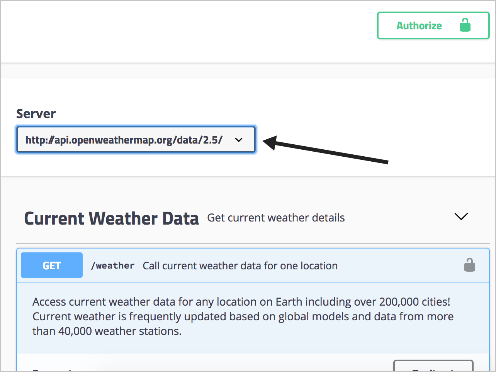
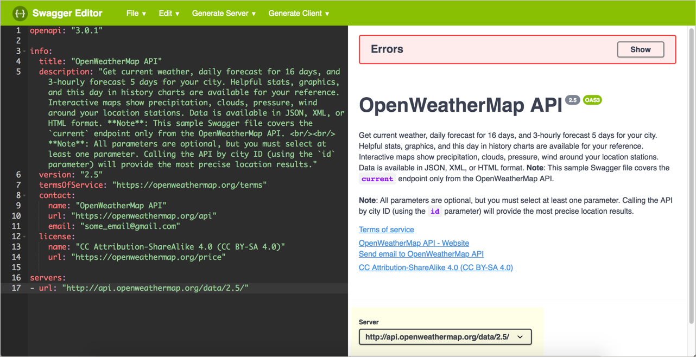
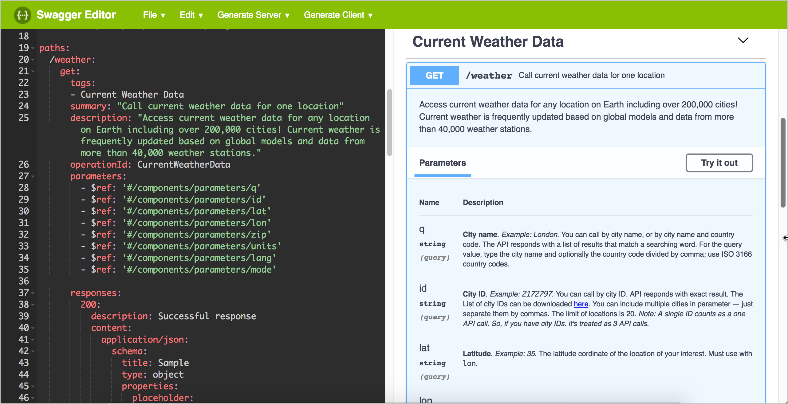
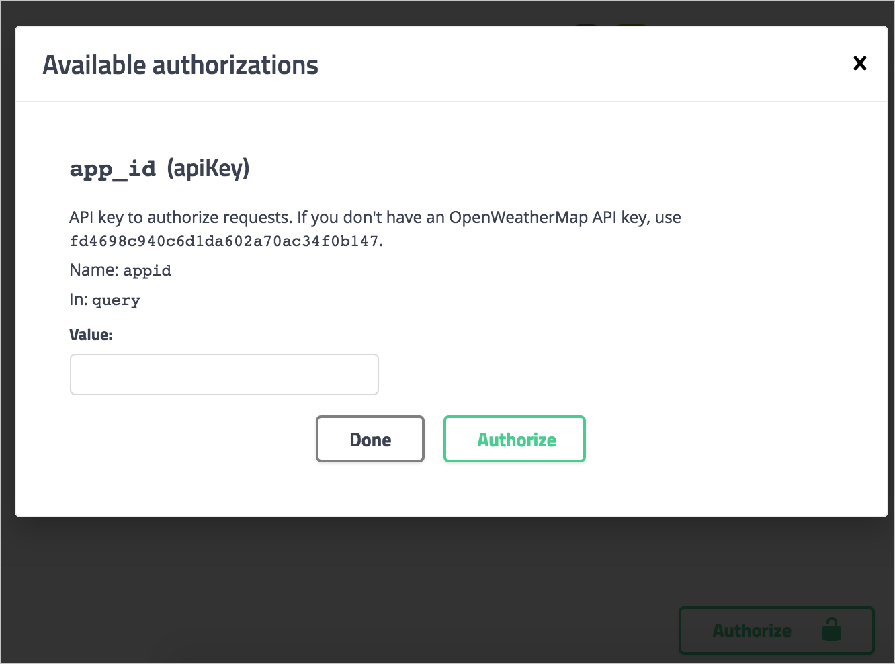
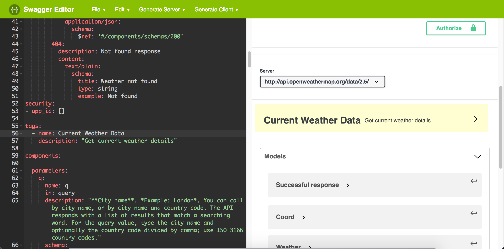

## Кореневі об'єкти в специфікації OpenAPI

> Під «кореневим рівнем» мається на увазі перший рівень в документі OpenAPI. Цей рівень також називається глобальним рівнем, тому що деякі властивості об'єкта, оголошені тут (а саме, сервери і безпеку), застосовуються до кожного з об'єктів операції, якщо не перевизначені на більш низькому рівні.

На верхньому рівні в специфікації OpenAPI 3.0 існує вісім об'єктів. Усередині цих верхнеуровневих об'єктів є багато вкладених об'єктів, але на верхньому рівні є тільки такі об'єкти:

- openapi
- info
- servers
- paths
- components
- security
- tags
- externalDocs

Весь документ (об'єкт, що містить вісім об'єктів кореневого рівня) називається документом OpenAPI. За прийнятим угодою документу привласнюють ім'я ** openapi.yml **.


## Додаємо об'єкт `openapi`

Переходимо в редактор Swagger і вибираємо ** File> Clear editor **. Залишимо цю вкладку відкритою поки вивчаємо керівництво по OpenAPI, так як будемо оновлювати документ специфікації з кожним кроком.

Введемо перша властивість кореневого рівня для документа специфікації: `openapi`. В об'єкті openapi вказуємо версію специфікації OpenAPI для перевірки. Остання версія 3.0.2.

```Yaml
openapi: "3.0.2"
```


## Подання в Swagger UI

Об'єкт `openapi` не такий великий, і зараз не вистачає контенту для перевірки специфікації. Але коли ми пізніше визуализируем свій документ специфікації, ми побачимо, що тег «OAS3» з'явиться одразу після назви API.



На сервері Swagger UI використовує версію специфікації 3.0.2 для перевірки вашого контенту.

## Приклад об'єкта `info`

Ось приклад об'єкта `info` і його властивостей

```yaml
openapi: "3.0.2"
info:
  title: "OpenWeatherMap API"
  description: "Get the current weather, daily forecast for 16 days, and a three-hour-interval forecast for 5 days for your city. Helpful stats, graphics, and this day in history charts are available for your reference. Interactive maps show precipitation, clouds, pressure, wind around your location stations. Data is available in JSON, XML, or HTML format. **Note**: This sample Swagger file covers the `current` endpoint only from the OpenWeatherMap API. <br/><br/> **Note**: All parameters are optional, but you must select at least one parameter. Calling the API by city ID (using the `id` parameter) will provide the most precise location results."
  version: "2.5"
  termsOfService: "https://openweathermap.org/terms"
  contact:
    name: "OpenWeatherMap API"
    url: "https://openweathermap.org/api"
    email: "some_email@gmail.com"
  license:
    name: "CC Attribution-ShareAlike 4.0 (CC BY-SA 4.0)"
    url: "https://openweathermap.org/price"
```

> При описі властивостей можна використовувати CommonMark Markdown, який більш точний, однозначний і надійний, ніж оригінальний Markdown. Наприклад, CommonMark Markdown пропонує зворотні Слеш і точно визначає, скільки прогалин потрібно в списках і інших пунктуації. Також можна переходити на нові рядки за допомогою `\ n` і уникати проблемні символи, такі як лапки або двокрапки з зворотною косою межею.

При написанні контенту в властивості `description`, потрібно звернути увагу, що двокрапки є проблематичними в YAML, тому що вони позначають нові рівні. Або уникайте двокрапок зі зворотним косою рисою, або укладіть значення `description` в лапки. Можна використовувати одинарні або подвійні лапки для значень властивостей. (Якщо укладати значення в лапки, в текстових редакторах може відображатися підсвічування коду властивостей і значень.)


## Відображення в Swagger UI

Рухаємося далі: вставляємо код разом з об'єктом `openapi` з попереднього кроку в редактор Swagger. У Swagger UI відображені помилки рендеринга (оскільки в документі специфікації ще немає об'єктів `path`), але вміст все одно буде відображатися. (Можна поки згорнути вікно помилок у верхній частині натиснувши `Hide`).

Інформація в Swagger UI буде відображатися в такий спосіб:



В `description`, на додаток до опису загального API, можна надати користувачам кілька основних інструкцій по використанню Swagger UI. Якщо є тестова обліковий запис, яку вони повинні використовувати, можна надати їм необхідну інформацію в цьому полі.

## Приклад об'єкта `servers`

Приклад об'єкта `servers`

```
servers:
- url: https://api.openweathermap.org/data/2.5/
```

Кожна з кінцевих точок (званих в специфікації `paths`) буде додаватися до URL-адресою сервера, при відправці користувачами пробних запитів` Try it out`. Наприклад, якщо одним із шляхів является` / weather`, то при відправці запиту Swagger UI представить шлях до `{server URL} {path}`

## Опції URL сервера

Об'єкт `servers` володіє гнучким налаштуванням. Можна вказати кілька URL-адрес серверів, які можуть ставитися до різних середовищ (тестова, бета-версія, робоча версія). При наявності декількох URL-адрес серверів, користувачі можуть вибирати середу в списку серверів. Можна вказати кілька URL-адрес серверів, наприклад:

```
servers:
  - url: https://api.openweathermap.org/data/2.5/
        description: Production server
  - url: http://beta.api.openweathermap.org/data/2.5/
        description: Beta server
  - url: http://some-other.api.openweathermap.org/data/2.5/
        description: Some other server
```

У Swagger UI вибір з кількох серверів здійснюється за допомогою списку



Якщо вказано один сервер все одно буде відображатися список, що випадає, але з одним варіантом.

В URL-адресу сервера також можна включати змінні, які будуть заповнюватися сервером під час виконання. Крім того, якщо для різних шляхів (кінцевих точок) потрібні різні URL-адреси сервера, можна додати об'єкт `servers` як властивості в об'єкті операції об'єкта` path`. URL-адресу локально оголошених серверів переопределяет URL-адресу глобальних серверів.


##  Відображення в Swagger UI

Вставимо об'єкт `servers` (перший приклад коду вище, показує тільки один URL) в редактор Swagger, додавши до наявного коду. Swagger UI буде виглядати наступним чином:



## Об'єкти `paths`

> Об'єкт `paths` - це та ж« кінцева точка »відповідно до термінології специфікації OpenAPI.

Кожен елемент в об'єкті `path` містить об'єкт` operations`. `Operations` - це методи GET, POST, PUT і DELETE.

Починаємо з перерахування шляхів (кінцевих точок) і їх дозволених операцій (методів). Для кінцевої точки `weather` в API OpenWeatherMap є тільки один шлях (` / weather`) і одна операція ( `get`) для цього шляху:

```Yaml
paths:
  / Weather:
    get:
```

### Об'єкт `operations`


> Безсумнівно, потрібно звертатися до специфікації OpenAPI, щоб дізнатися, які деталі потрібні для кожного із значень і об'єктів. На курсі немає можливості відтворити всі потрібні деталі. Тут просто поверхневе знайомство з властивостями OpenAPI.

Давайте додамо скелет об'єкта `operations` до нашого коду:

```yaml
paths:
  /weather:
    get:
      tags:
      summary:
      description:
      operationId:
      externalDocs:
      parameters:
      responses:
      deprecated:
      security:
      servers:
      requestBody:
      callbacks:
```

Видалимо кілька непотрібних полів, які нам не потрібні для нашої документації по API OpenWeatherMap:

- Немає необхідності включати об'єкт `requestBody` бо жоден шлях API OpenWeatherMap не містить параметрів тіла запиту.
- Немає необхідності включати об'єкт `servers` бо використовується той же URL глобальних` servers`, який ми визначили глобально на кореневому рівні
- Немає необхідності включати security бо використовується один і той же об'єкт `security`, який ми визначимо глобально на кореневому рівні пізніше).
- Немає необхідності включати `deprecated` бо жоден з шляхів не застарів.
- Немає необхідності включати `callbacks` бо жоден із шляхів не використовує колбекі.

В результаті ми можемо зменшити кількість відповідних полів до наступного:

```yaml
paths:
  /weather:
    get:
      tags:
      summary:
      description:
      operationId:
      externalDocs:
      parameters:
      responses:
```

Більшість властивостей для об'єктів операції або вимагають простих рядків, або містять відносно прості об'єкти. Найбільш докладні об'єкти тут - це об'єкт `parameters` об'єкт` responses`.

#### Об'єкт `parameters`

Об'єкт `parameters` містить масив з наступними властивостями:

- `name`: ім'я параметра.
- `in`: місце параметра. Можливі значення: `header`,` path`, `query`, або` cookie`. (Параметри тіла запиту тут не описані.).
- `description`: опис параметра.
- `required`: потрібно чи параметр.
- `deprecated`: чи є параметр застарілим.
- `allowEmptyValue`: чи дозволяє параметр передавати пусте значення.
- `style`: як дані параметра серіалізуются (перетворюються в байти під час передачі даних).
- `explode`: розширений параметр, пов'язаний з масивами.
- `allowReserved`: чи дозволені зарезервовані символи.
- `schema` (об'єкт): Схема або модель для параметра. Схема визначає структуру вхідних або вихідних даних. Зверніть увагу, що `schema` також може містити об'єкт` example`.
- `example`: приклад типу носія. Якщо об'єкт `example` містить приклади, ці приклади з'являються в Swagger UI, а не по змісту об'єкта` example`.
- `examples` (об'єкт): Приклад типу носія, що включає схему.

Ось об'єкт `paths`, який включає деталі` parameters`:

```yaml    
paths:
  /weather:
    get:
      tags:
      - Current Weather Data
      summary: "Call current weather data for one location."
      description: "Access current weather data for any location on Earth including over 200,000 cities! Current weather is frequently updated based on global models and data from more than 40,000 weather stations."
      operationId: CurrentWeatherData
      parameters:
      - name: q
        in: query
        description: "**City name**. *Example: London*. You can call by city name, or by city name and country code. The API responds with a list of results that match a searching word. For the query value, type the city name and optionally the country code divided by a comma; use ISO 3166 country codes."
        schema:
          type: string

      - name: id
        in: query
        description: "**City ID**. *Example: `2172797`*. You can call by city ID. The API responds with the exact result. The List of city IDs can be downloaded [here](http://bulk.openweathermap.org/sample/). You can include multiple cities in this parameter &mdash; just separate them by commas. The limit of locations is 20. *Note: A single ID counts as a one API call. So, if you have city IDs, it's treated as 3 API calls.*"
        schema:
          type: string

      - name: lat
        in: query
        description: "**Latitude**. *Example: 35*. The latitude coordinate of the location of your interest. Must use with `lon`."
        schema:
          type: string

      - name: lon
        in: query
        description: "**Longitude**. *Example: 139*. Longitude coordinate of the location of your interest. Must use with `lat`."
        schema:
          type: string

      - name: zip
        in: query
        description: "**Zip code**. Search by zip code. *Example: 95050,us*. Please note that if the country is not specified, the search uses USA as a default."
        schema:
          type: string

      - name: units
        in: query
        description: '**Units**. *Example: imperial*. Possible values: `standard`, `metric`, and `imperial`. When you do not use the `units` parameter, the format is `standard` by default.'
        schema:
          type: string
          enum: [standard, metric, imperial]
          default: "imperial"

      - name: lang
        in: query
        description: '**Language**. *Example: en*. You can use lang parameter to get the output in your language. We support the following languages that you can use with the corresponded lang values: Arabic - `ar`, Bulgarian - `bg`, Catalan - `ca`, Czech - `cz`, German - `de`, Greek - `el`, English - `en`, Persian (Farsi) - `fa`, Finnish - `fi`, French - `fr`, Galician - `gl`, Croatian - `hr`, Hungarian - `hu`, Italian - `it`, Japanese - `ja`, Korean - `kr`, Latvian - `la`, Lithuanian - `lt`, Macedonian - `mk`, Dutch - `nl`, Polish - `pl`, Portuguese - `pt`, Romanian - `ro`, Russian - `ru`, Swedish - `se`, Slovak - `sk`, Slovenian - `sl`, Spanish - `es`, Turkish - `tr`, Ukrainian - `ua`, Vietnamese - `vi`, Chinese Simplified - `zh_cn`, Chinese Traditional - `zh_tw`.'
        schema:
          type: string
          enum: [ar, bg, ca, cz, de, el, en, fa, fi, fr, gl, hr, hu, it, ja, kr, la, lt, mk, nl, pl, pt, ro, ru, se, sk, sl, es, tr, ua, vi, zh_cn, zh_tw]
          default: "en"

      - name: mode
        in: query
        description: "**Mode**. *Example: html*. Determines the format of the response. Possible values are `xml` and `html`. If the mode parameter is empty, the format is `json` by default."
        schema:
          type: string
          enum: [json, xml, html]
          default: "json"
```


#### Об'єкт `responses`

Інша істотна властивість в об'єкті операцій - це об'єкт `responses`. Для властивості `responses` зазвичай посилаються на повне визначення в об'єкті` components`, тому розповідь про об'єкт `responses` в наступному розділі - Крок 5. Об'єкт` components`). (На цьому етапі вже занадто багато інформації.)

На даний момент, щоб редактор Swagger перевірив і показав наш шлях, давайте просто додамо деякий контент-заповнювач для `responses`:

```yaml
responses:
  200:
    description: Successful response
    content:
      application/json:
        schema:
          title: Sample
          type: object
          properties:
            placeholder:
              type: string
              description: Placeholder description

  404:
    description: Not found response
    content:
      text/plain:
        schema:
          title: Weather not found
          type: string
          example: Not found
```


## Код об'єкта `paths`

Тепер давайте об'єднаємо два вищезгаданих блоку коду (і `parameters`, і` responses`) для нашого об'єкта `paths`. Чи можемо вставити цей код в редактор Swagger, додаємо наш об'єкт `paths` під кодом` openapi`, `info` і` server`, які ми додали в попередніх уроках.

```yaml
paths:
  /weather:
    get:
      tags:
      - Current Weather Data
      summary: "Call current weather data for one location."
      description: "Access current weather data for any location on Earth including over 200,000 cities! Current weather is frequently updated based on global models and data from more than 40,000 weather stations."
      operationId: CurrentWeatherData
      parameters:
      - name: q
        in: query
        description: "**City name**. *Example: London*. You can call by city name, or by city name and country code. The API responds with a list of results that match a searching word. For the query value, type the city name and optionally the country code divided by a comma; use ISO 3166 country codes."
        schema:
          type: string

      - name: id
        in: query
        description: "**City ID**. *Example: `2172797`*. You can call by city ID. The API responds with the exact result. The List of city IDs can be downloaded [here](http://bulk.openweathermap.org/sample/). You can include multiple cities in this parameter &mdash; just separate them by commas. The limit of locations is 20. *Note: A single ID counts as a one API call. So, if you have city IDs, it's treated as 3 API calls.*"
        schema:
          type: string

      - name: lat
        in: query
        description: "**Latitude**. *Example: 35*. The latitude coordinate of the location of your interest. Must use with `lon`."
        schema:
          type: string

      - name: lon
        in: query
        description: "**Longitude**. *Example: 139*. Longitude coordinate of the location of your interest. Must use with `lat`."
        schema:
          type: string

      - name: zip
        in: query
        description: "**Zip code**. Search by zip code. *Example: 95050,us*. Please note that if the country is not specified, the search uses USA as a default."
        schema:
          type: string

      - name: units
        in: query
        description: '**Units**. *Example: imperial*. Possible values: `standard`, `metric`, and `imperial`. When you do not use the `units` parameter, the format is `standard` by default.'
        schema:
          type: string
          enum: [standard, metric, imperial]
          default: "imperial"

      - name: lang
        in: query
        description: '**Language**. *Example: en*. You can use lang parameter to get the output in your language. We support the following languages that you can use with the corresponded lang values: Arabic - `ar`, Bulgarian - `bg`, Catalan - `ca`, Czech - `cz`, German - `de`, Greek - `el`, English - `en`, Persian (Farsi) - `fa`, Finnish - `fi`, French - `fr`, Galician - `gl`, Croatian - `hr`, Hungarian - `hu`, Italian - `it`, Japanese - `ja`, Korean - `kr`, Latvian - `la`, Lithuanian - `lt`, Macedonian - `mk`, Dutch - `nl`, Polish - `pl`, Portuguese - `pt`, Romanian - `ro`, Russian - `ru`, Swedish - `se`, Slovak - `sk`, Slovenian - `sl`, Spanish - `es`, Turkish - `tr`, Ukrainian - `ua`, Vietnamese - `vi`, Chinese Simplified - `zh_cn`, Chinese Traditional - `zh_tw`.'
        schema:
          type: string
          enum: [ar, bg, ca, cz, de, el, en, fa, fi, fr, gl, hr, hu, it, ja, kr, la, lt, mk, nl, pl, pt, ro, ru, se, sk, sl, es, tr, ua, vi, zh_cn, zh_tw]
          default: "en"

      - name: mode
        in: query
        description: "**Mode**. *Example: html*. Determines the format of the response. Possible values are `xml` and `html`. If the mode parameter is empty, the format is `json` by default."
        schema:
          type: string
          enum: [json, xml, html]
          default: "json"

      responses:
        200:
          description: Successful response
          content:
            application/json:
              schema:
                title: Sample
                type: object
                properties:
                  placeholder:
                    type: string
                    description: Placeholder description

        404:
          description: Not found response
          content:
            text/plain:
              schema:
                title: Weather not found
                type: string
                example: Not found
```


## Відображення в Swagger UI

Відображення `paths` в Swagger UI буде таким:




Щоб побачити подробиці розгорнемо наш розділ «Current Weather Data». Коли натиснемо ** Try it out **, ви побачите, що поле заповнюється описом. Якщо ви хочете, щоб поле заповнювався значенням, додайте властивість `default` в схему (як показано з параметром` mode` в наведеному вище коді).

Однак, всі параметри не можуть бути передані з одним і тим же запитом - ви використовуєте тільки ті параметри, які вам потрібні для запиту, який ви робите. (Наприклад, ви не можете передавати поштовий індекс і назва міста, а також широту / довготу і т.д. в одному запиті.) Тому не має сенсу використовувати значення за замовчуванням для кожного параметра, оскільки тоді користувачеві буде потрібно видалити більшість з них.


## Примітка про залежності параметрів

Специфікація OpenAPI не дозволяє оголошувати залежності з параметрами або взаємовиключними параметрами. У документації Swagger OpenAPI зазначено:


У разі кінцевої точки погоди з OpenWeatherMap більшість параметрів є взаємовиключними. Ми не можемо виконувати пошук за ідентифікатором міста і поштовим індексом одночасно. Хоча параметри є необов'язковими, ми повинні використовувати хоча б один параметр. Крім того, при використанні параметра `lat`, потрібно використовувати і параметр` lon`, тому що це парні параметри. Специфікація OpenAPI не може програмно відображати цю структуровану логіку, тому ми повинні пояснити це у властивості `description` або в інший, більш концептуальної документації.

Об'єкт `components` унікальний серед інших об'єктів в специфікації OpenAPI. В `components` зберігаються переіспользуемие визначення, які можуть з'являтися в декількох місцях в документі специфікації. У нашому сценарії документації API ми будемо зберігати деталі для об'єктів `parameters` і` responses` в об'єкті `components`.

Причини використання об'єкта `components`

Об'єкти в `components`] (# objects)

Перевикористання параметрів в декількох шляхах] (# reuseParams)

Перевикористання об'єктів `responses`] (# reuseObjects)

Опис схеми] (# schema)

Спосіб обдурити - автоматично генерувати схему з JSON, використовуючи Stoplight] (# cheat)

Використання GUI редакторів для роботи з кодом специфікації] (# gui)

Відображення в Swagger UI

Розділ Models - чому він існує, як його приховати

Визначення `security`

## Причини використання об'єкта `components`

Опис деталей параметрів і схеми складних відповідей може бути найбільш складним аспектом специфікації OpenAPI. Хоча можна визначити параметри і відповіді безпосередньо в об'єктах параметрів і відповідей, як правило, вони не перераховуються там з двох причин:

- Можливо, буде бажання перевикористати частини цих визначень в інших запитах або відповідях. Зазвичай один і той же параметр або відповідь використовується в декількох місцях в API. За допомогою об'єкта `components` OpenAPI дозволяє вам повторно використовувати одні і ті ж визначення в декількох місцях.
- Можливо, не захочеться захаращувати свій об'єкт `paths` занадто великою кількістю параметрів і подробиць відповіді, оскільки об'єкт` paths` вже і так складний через декілька рівнів об'єктів.


Об'єкт `components` можна уявити як про додатку до документа, в якому надані дані для повторного використання. Якщо кілька частин специфікації мають одну і ту ж схему, можна вказувати посилання на один і той же об'єкт в об'єкті `components`, і при цьому ви отримуєте єдине джерело контенту. Об'єкт `components` може навіть зберігатися в окремому файлі, для більш простий організації інформації в великих API. (Онлайн-редактор Swagger не дозволяє використовувати кілька файлів для перевірки вмісту.)


## Об'єкти в `components`

В об'єкті `components` можна зберігати безліч різних переіспользуемих об'єктів. Об'єкт `components` може містити наступне:

- [схеми](https://github.com/OAI/OpenAPI-Specification/blob/master/versions/3.0.2.md#schemaObject);
- [відповіді](https://github.com/OAI/OpenAPI-Specification/blob/master/versions/3.0.2.md#responses-object);
- [параметри](https://github.com/OAI/OpenAPI-Specification/blob/master/versions/3.0.2.md#parameterObject);
- [приклади](https://github.com/OAI/OpenAPI-Specification/blob/master/versions/3.0.2.md#parameter-object-examples);
- [тіло запиту](https://github.com/OAI/OpenAPI-Specification/blob/master/versions/3.0.2.md#requestBodyObject);
- [хедери](https://github.com/OAI/OpenAPI-Specification/blob/master/versions/3.0.2.md#headerObject);
- [схеми безпеки](https://github.com/OAI/OpenAPI-Specification/blob/master/versions/3.0.2.md#securitySchemeObject);
- [посилання](https://github.com/OAI/OpenAPI-Specification/blob/master/versions/3.0.2.md#linkObject);
- [коллбекі](https://github.com/OAI/OpenAPI-Specification/blob/master/versions/3.0.2.md#callbackObject);


## Перевикористання параметрів в декількох шляхах

На попередньому етапі Для параметрів ми перерахували всі деталі безпосередньо в об'єкті `parameters`. Щоб полегшити перевикористання тих же параметрів в інших шляхах, давайте збережемо вміст `parameters` в` components`. Код нижче показує, як зробити ці посилання:

```yaml
paths:
  /weather:
    get:
      tags:
      - Current Weather Data
      summary: "Call current weather data for one location"
      description: "Access current weather data for any location on Earth including over 200,000 cities! Current weather is frequently updated based on global models and data from more than 40,000 weather stations."
      operationId: CurrentWeatherData
      parameters:
        - $ref: '#/components/parameters/q'
        - $ref: '#/components/parameters/id'
        - $ref: '#/components/parameters/lat'
        - $ref: '#/components/parameters/lon'
        - $ref: '#/components/parameters/zip'
        - $ref: '#/components/parameters/units'
        - $ref: '#/components/parameters/lang'
        - $ref: '#/components/parameters/mode'

      responses:
        200:
          description: Successful response
          content:
            application/json:
              schema:
                title: Sample
                type: object
                properties:
                  placeholder:
                    type: string
                    description: Placeholder description

        404:
          description: Not found response
          content:
            text/plain:
              schema:
                title: Weather not found
                type: string
                example: Not found

components:

  parameters:
    q:
      name: q
      in: query
      description: "**City name**. *Example: London*. You can call by city name, or by city name and country code. The API responds with a list of results that match a searching word. For the query value, type the city name and optionally the country code divided by a comma; use ISO 3166 country codes."
      schema:
        type: string
    id:
      name: id
      in: query
      description: "**City ID**. *Example: `2172797`*. You can call by city ID. The API responds with the exact result. The List of city IDs can be downloaded [here](http://bulk.openweathermap.org/sample/). You can include multiple cities in this parameter &mdash; just separate them by commas. The limit of locations is 20. *Note: A single ID counts as a one API call. So, if you have city IDs, it's treated as 3 API calls.*"
      schema:
        type: string

    lat:
      name: lat
      in: query
      description: "**Latitude**. *Example: 35*. The latitude coordinate of the location of your interest. Must use with `lon`."
      schema:
        type: string

    lon:
      name: lon
      in: query
      description: "**Longitude**. *Example: 139*. Longitude coordinate of the location of your interest. Must use with `lat`."
      schema:
        type: string

    zip:
      name: zip
      in: query
      description: "**Zip code**. Search by zip code. *Example: 95050,us*. Please note that if the country is not specified, the search uses USA as a default."
      schema:
        type: string

    units:
      name: units
      in: query
      description: '**Units**. *Example: imperial*. Possible values: `standard`, `metric`, and `imperial`. When you do not use the `units` parameter, the format is `standard` by default.'
      schema:
        type: string
        enum: [standard, metric, imperial]
        default: "imperial"

    lang:
      name: lang
      in: query
      description: '**Language**. *Example: en*. You can use lang parameter to get the output in your language. We support the following languages that you can use with the corresponded lang values: Arabic - `ar`, Bulgarian - `bg`, Catalan - `ca`, Czech - `cz`, German - `de`, Greek - `el`, English - `en`, Persian (Farsi) - `fa`, Finnish - `fi`, French - `fr`, Galician - `gl`, Croatian - `hr`, Hungarian - `hu`, Italian - `it`, Japanese - `ja`, Korean - `kr`, Latvian - `la`, Lithuanian - `lt`, Macedonian - `mk`, Dutch - `nl`, Polish - `pl`, Portuguese - `pt`, Romanian - `ro`, Russian - `ru`, Swedish - `se`, Slovak - `sk`, Slovenian - `sl`, Spanish - `es`, Turkish - `tr`, Ukrainian - `ua`, Vietnamese - `vi`, Chinese Simplified - `zh_cn`, Chinese Traditional - `zh_tw`.'
      schema:
        type: string
        enum: [ar, bg, ca, cz, de, el, en, fa, fi, fr, gl, hr, hu, it, ja, kr, la, lt, mk, nl, pl, pt, ro, ru, se, sk, sl, es, tr, ua, vi, zh_cn, zh_tw]
        default: "en"

    mode:
      name: mode
      in: query
      description: "**Mode**. *Example: html*. Determines the format of the response. Possible values are `xml` and `html`. If the mode parameter is empty, the format is `json` by default."
      schema:
        type: string
        enum: [json, xml, html]
        default: "json"
```
Замінимо існуючий об'єкт `paths` в редакторі Swagger наведеним вище прикладом коду, включивши новий об'єкт` components` і звернемо увагу, що відображається картинка як і раніше виглядає так само.


## Перевикористання об'єктів `responses`


Давайте глибше вивчимо те, як використовувати властивості схеми для документування об'єкта `response`. Ми також будемо зберігати вміст схеми в `components`, щоб його можна було повторно використовувати в інших частинах документа специфікації. Якщо згадати попередній крок, об'єкт відповідей для кінцевої точки погоди виглядав так:

```yaml
paths:
  /current:
    get:
      parameters:

      ...

      responses:
        200:
          description: Successful response
          content:
            application/json:
              schema:
                title: Sample
                type: object
                properties:
                  placeholder:
                    type: string
                    description: Placeholder description

        404:
          description: Not found response
          content:
            text/plain:
              schema:
                title: Weather not found
                type: string
                example: Not found
```

Перенесемо опис `schema` для відповіді` 200` в об'єкт `components`:

```yaml
paths:
  /weather:
    get:
      tags:
      - Current Weather Data
      summary: "Call current weather data for one location"
      description: "Access current weather data for any location on Earth including over 200,000 cities! Current weather is frequently updated based on global models and data from more than 40,000 weather stations."
      operationId: CurrentWeatherData
      parameters:
        - $ref: '#/components/parameters/q'
        - $ref: '#/components/parameters/id'
        - $ref: '#/components/parameters/lat'
        - $ref: '#/components/parameters/lon'
        - $ref: '#/components/parameters/zip'
        - $ref: '#/components/parameters/units'
        - $ref: '#/components/parameters/lang'
        - $ref: '#/components/parameters/mode'

      responses:
        200:
          description: Successful response
          content:
            application/json:
              schema:
                $ref: '#/components/schemas/200'
        404:
          description: Not found response
          content:
            text/plain:
              schema:
                title: Weather not found
                type: string
                example: Not found
```

Потім в `components / schemas` ми визначимо схему` 200`.

Перш ніж ми опишемо відповідь в об'єкті `components`, може бути корисно подивитися, як виглядає відповідь` weather` від API OpenWeatherMap. Відповідь JSON містить кілька вкладених об'єктів на різних рівнях.

```json
{
  "coord": {
    "lon": 145.77,
    "lat": -16.92
  },
  "weather": [
    {
      "id": 803,
      "main": "Clouds",
      "description": "broken clouds",
      "icon": "04n"
    }
  ],
  "base": "cmc stations",
  "main": {
    "temp": 293.25,
    "pressure": 1019,
    "humidity": 83,
    "temp_min": 289.82,
    "temp_max": 295.37,
    "sea_level": 984,
    "grnd_level": 990
  },
  "wind": {
    "speed": 5.1,
    "deg": 150
  },
  "clouds": {
    "all": 75
  },
  "rain": {
    "3h": 3
  },
  "snow": {
    "3h": 6
  },
  "dt": 1435658272,
  "sys": {
    "type": 1,
    "id": 8166,
    "message": 0.0166,
    "country": "AU",
    "sunrise": 1435610796,
    "sunset": 1435650870
  },
  "id": 2172797,
  "name": "Cairns",
  "cod": 200
}
```

Існує кілька способів опису цієї відповіді. Можна створити довгий опис, що містить всю відбиту ієрархію. Однак однією з проблем такого підходу є те, що важко підтримувати всі рівні на одному рівні. З такою кількістю вкладених об'єктів це запаморочливо заплутано. Крім того, легко помилитися. Найгірше те, що не можна перевикористати окремі об'єкти. В першу чергу це підриває одну з основних причин збереження цього об'єкта в `components`.

Інший підхід полягає в тому, щоб зробити кожен об'єкт своєю сутністю в `components`. Коли об'єкт містить об'єкт, додайте значення `$ ref`, яке вказує на новий об'єкт. Таким чином, об'єкти залишаються неглибокими (замість декількох рівнів вкладеності), і ми не загубимось в море заплутаних підрівнів. (Якщо підоб'єкту немає, просто надамо опис безпосередньо, без використання `$ ref`.

Ось опис відповіді `200` для кінцевої точки` weather`. Я включив тег `paths` для підтримки контексту:

Об'єкт `responses` з документацією` components`:

```yaml
paths:
  /weather:
    get:
      tags:
      - Current Weather Data
      summary: "Call current weather data for one location"
      description: "Access current weather data for any location on Earth including over 200,000 cities! Current weather is frequently updated based on global models and data from more than 40,000 weather stations."
      operationId: CurrentWeatherData
      parameters:
        - $ref: '#/components/parameters/q'
        - $ref: '#/components/parameters/id'
        - $ref: '#/components/parameters/lat'
        - $ref: '#/components/parameters/lon'
        - $ref: '#/components/parameters/zip'
        - $ref: '#/components/parameters/units'
        - $ref: '#/components/parameters/lang'
        - $ref: '#/components/parameters/mode'

      responses:
        200:
          description: Successful response
          content:
            application/json:
              schema:
                $ref: '#/components/schemas/200'
        404:
          description: Not found response
          content:
            text/plain:
              schema:
                title: Weather not found
                type: string
                example: Not found

components:

  parameters:
    # not shown for the sake of brevity -- see the earlier code block for details
    ...

  schemas:
    200:
      title: Successful response
      type: object
      properties:
        coord:
          $ref: '#/components/schemas/Coord'
        weather:
          type: array
          items:
            $ref: '#/components/schemas/Weather'
          description: (more info Weather condition codes)
        base:
          type: string
          description: Internal parameter
          example: cmc stations
        main:
          $ref: '#/components/schemas/Main'
        visibility:
          type: integer
          description: Visibility, meter
          example: 16093
        wind:
          $ref: '#/components/schemas/Wind'
        clouds:
          $ref: '#/components/schemas/Clouds'
        rain:
          $ref: '#/components/schemas/Rain'
        snow:
          $ref: '#/components/schemas/Snow'
        dt:
          type: integer
          description: Time of data calculation, unix, UTC
          format: int32
          example: 1435658272
        sys:
          $ref: '#/components/schemas/Sys'
        id:
          type: integer
          description: City ID
          format: int32
          example: 2172797
        name:
          type: string
          example: Cairns
        cod:
          type: integer
          description: Internal parameter
          format: int32
          example: 200
    Coord:
      title: Coord
      type: object
      properties:
        lon:
          type: number
          description: City geo location, longitude
          example: 145.77000000000001
        lat:
          type: number
          description: City geo location, latitude
          example: -16.920000000000002
    Weather:
      title: Weather
      type: object
      properties:
        id:
          type: integer
          description: Weather condition id
          format: int32
          example: 803
        main:
          type: string
          description: Group of weather parameters (Rain, Snow, Extreme etc.)
          example: Clouds
        description:
          type: string
          description: Weather condition within the group
          example: broken clouds
        icon:
          type: string
          description: Weather icon id
          example: 04n
    Main:
      title: Main
      type: object
      properties:
        temp:
          type: number
          description: 'Temperature. Unit Default: Kelvin, Metric: Celsius, Imperial: Fahrenheit.'
          example: 293.25
        pressure:
          type: integer
          description: Atmospheric pressure (on the sea level, if there is no sea_level or grnd_level data), hPa
          format: int32
          example: 1019
        humidity:
          type: integer
          description: Humidity, %
          format: int32
          example: 83
        temp_min:
          type: number
          description: 'Minimum temperature at the moment. This is deviation from current temp that is possible for large cities and megalopolises geographically expanded (use these parameter optionally). Unit Default: Kelvin, Metric: Celsius, Imperial: Fahrenheit.'
          example: 289.81999999999999
        temp_max:
          type: number
          description: 'Maximum temperature at the moment. This is deviation from current temp that is possible for large cities and megalopolises geographically expanded (use these parameter optionally). Unit Default: Kelvin, Metric: Celsius, Imperial: Fahrenheit.'
          example: 295.37
        sea_level:
          type: number
          description: Atmospheric pressure on the sea level, hPa
          example: 984
        grnd_level:
          type: number
          description: Atmospheric pressure on the ground level, hPa
          example: 990
    Wind:
      title: Wind
      type: object
      properties:
        speed:
          type: number
          description: 'Wind speed. Unit Default: meter/sec, Metric: meter/sec, Imperial: miles/hour.'
          example: 5.0999999999999996
        deg:
          type: integer
          description: Wind direction, degrees (meteorological)
          format: int32
          example: 150
    Clouds:
      title: Clouds
      type: object
      properties:
        all:
          type: integer
          description: Cloudiness, %
          format: int32
          example: 75
    Rain:
      title: Rain
      type: object
      properties:
        3h:
          type: integer
          description: Rain volume for the last 3 hours
          format: int32
          example: 3
    Snow:
      title: Snow
      type: object
      properties:
        3h:
          type: number
          description: Snow volume for the last 3 hours
          example: 6
    Sys:
      title: Sys
      type: object
      properties:
        type:
          type: integer
          description: Internal parameter
          format: int32
          example: 1
        id:
          type: integer
          description: Internal parameter
          format: int32
          example: 8166
        message:
          type: number
          description: Internal parameter
          example: 0.0166
        country:
          type: string
          description: Country code (GB, JP etc.)
          example: AU
        sunrise:
          type: integer
          description: Sunrise time, unix, UTC
          format: int32
          example: 1435610796
        sunset:
          type: integer
          description: Sunset time, unix, UTC
          format: int32
          example: 1435650870    
```


## Опис схеми

Для більшості розділів в `components` описами об'єктів тим же, що детально описані в іншій частині специфікації. При описі об'єкта `schema` використовуються стандартні ключові слова і терміни зі схеми JSON, зокрема з специфікації JSON Schema Wright Draft 00.

Іншими словами, ми не просто використовуємо терміни, визначені в специфікації OpenAPI, для опису моделей вашого JSON. При описі своєї моделі JSON (структури даних для вхідних і вихідних об'єктів), термінологія в специфікації OpenAPI вводиться в більш широкі визначення JSON і мова опису для моделювання JSON. Використання OpenAPI схеми JSON є лише підмножиною повної схеми JSON.


Для опису JSON об'єктів можна використовувати визначається одним із таких:

- `title`;
- `multipleOf`;
- `maximum`;
- `exclusiveMaximum`;
- `minimum`;
- `exclusiveMinimum`;
- `maxLength`;
- `minLength`;
- `pattern`;
- `maxItems`;
- `minItems`;
- `uniqueItems`;
- `maxProperties`;
- `minProperties`;
- `required`;
- `enum`;
- `type`;
- `allOf`;
- `oneOf`;
- `anyOf`;
- `not`;
- `items`;
- `properties`;
- `additionalProperties`;
- `description`;
- `format`;
- `default`

Доступні типи даних:

- `integer`;
- `long`;
- `float`;
- `double`;
- `string`;
- `byte`;
- `binary`;
- `boolean`;
- `date`;
- `dateTime`;
- `password`.

При документуванні схеми, краще починати з перегляду об'єкта `schema` OpenAPI, а потім, якщо щось не вкрите, звернутися до схеми JSON.


## Відображення в Swagger UI

Скопіюємо код нижче і вставимо його в редактор Swagger після об'єктів `openapi`,` info` і `servers`

```yaml
paths:
  /weather:
    get:
      tags:
      - Current Weather Data
      summary: "Call current weather data for one location"
      description: "Access current weather data for any location on Earth including over 200,000 cities! Current weather is frequently updated based on global models and data from more than 40,000 weather stations."
      operationId: CurrentWeatherData
      parameters:
        - $ref: '#/components/parameters/q'
        - $ref: '#/components/parameters/id'
        - $ref: '#/components/parameters/lat'
        - $ref: '#/components/parameters/lon'
        - $ref: '#/components/parameters/zip'
        - $ref: '#/components/parameters/units'
        - $ref: '#/components/parameters/lang'
        - $ref: '#/components/parameters/mode'

      responses:
        200:
          description: Successful response
          content:
            application/json:
              schema:
                $ref: '#/components/schemas/200'
        404:
          description: Not found response
          content:
            text/plain:
              schema:
                title: Weather not found
                type: string
                example: Not found

components:

  parameters:
    q:
      name: q
      in: query
      description: "**City name**. *Example: London*. You can call by city name, or by city name and country code. The API responds with a list of results that match a searching word. For the query value, type the city name and optionally the country code divided by a comma; use ISO 3166 country codes."
      schema:
        type: string
    id:
      name: id
      in: query
      description: "**City ID**. *Example: `2172797`*. You can call by city ID. The API responds with the exact result. The List of city IDs can be downloaded [here](http://bulk.openweathermap.org/sample/). You can include multiple cities in this parameter &mdash; just separate them by commas. The limit of locations is 20. *Note: A single ID counts as a one API call. So, if you have city IDs, it's treated as 3 API calls.*"
      schema:
        type: string

    lat:
      name: lat
      in: query
      description: "**Latitude**. *Example: 35*. The latitude coordinate of the location of your interest. Must use with `lon`."
      schema:
        type: string

    lon:
      name: lon
      in: query
      description: "**Longitude**. *Example: 139*. Longitude coordinate of the location of your interest. Must use with `lat`."
      schema:
        type: string

    zip:
      name: zip
      in: query
      description: "**Zip code**. Search by zip code. *Example: 95050,us*. Please note that if the country is not specified, the search uses USA as a default."
      schema:
        type: string

    units:
      name: units
      in: query
      description: '**Units**. *Example: imperial*. Possible values: `standard`, `metric`, and `imperial`. When you do not use the `units` parameter, the format is `standard` by default.'
      schema:
        type: string
        enum: [standard, metric, imperial]
        default: "imperial"

    lang:
      name: lang
      in: query
      description: '**Language**. *Example: en*. You can use lang parameter to get the output in your language. We support the following languages that you can use with the corresponded lang values: Arabic - `ar`, Bulgarian - `bg`, Catalan - `ca`, Czech - `cz`, German - `de`, Greek - `el`, English - `en`, Persian (Farsi) - `fa`, Finnish - `fi`, French - `fr`, Galician - `gl`, Croatian - `hr`, Hungarian - `hu`, Italian - `it`, Japanese - `ja`, Korean - `kr`, Latvian - `la`, Lithuanian - `lt`, Macedonian - `mk`, Dutch - `nl`, Polish - `pl`, Portuguese - `pt`, Romanian - `ro`, Russian - `ru`, Swedish - `se`, Slovak - `sk`, Slovenian - `sl`, Spanish - `es`, Turkish - `tr`, Ukrainian - `ua`, Vietnamese - `vi`, Chinese Simplified - `zh_cn`, Chinese Traditional - `zh_tw`.'
      schema:
        type: string
        enum: [ar, bg, ca, cz, de, el, en, fa, fi, fr, gl, hr, hu, it, ja, kr, la, lt, mk, nl, pl, pt, ro, ru, se, sk, sl, es, tr, ua, vi, zh_cn, zh_tw]
        default: "en"

    mode:
      name: mode
      in: query
      description: "**Mode**. *Example: html*. Determines the format of the response. Possible values are `xml` and `html`. If the mode parameter is empty, the format is `json` by default."
      schema:
        type: string
        enum: [json, xml, html]
        default: "json"

  schemas:
    200:
      title: Successful response
      type: object
      properties:
        coord:
          $ref: '#/components/schemas/Coord'
        weather:
          type: array
          items:
            $ref: '#/components/schemas/Weather'
          description: (more info Weather condition codes)
        base:
          type: string
          description: Internal parameter
          example: cmc stations
        main:
          $ref: '#/components/schemas/Main'
        visibility:
          type: integer
          description: Visibility, meter
          example: 16093
        wind:
          $ref: '#/components/schemas/Wind'
        clouds:
          $ref: '#/components/schemas/Clouds'
        rain:
          $ref: '#/components/schemas/Rain'
        snow:
          $ref: '#/components/schemas/Snow'
        dt:
          type: integer
          description: Time of data calculation, unix, UTC
          format: int32
          example: 1435658272
        sys:
          $ref: '#/components/schemas/Sys'
        id:
          type: integer
          description: City ID
          format: int32
          example: 2172797
        name:
          type: string
          example: Cairns
        cod:
          type: integer
          description: Internal parameter
          format: int32
          example: 200
    Coord:
      title: Coord
      type: object
      properties:
        lon:
          type: number
          description: City geo location, longitude
          example: 145.77000000000001
        lat:
          type: number
          description: City geo location, latitude
          example: -16.920000000000002
    Weather:
      title: Weather
      type: object
      properties:
        id:
          type: integer
          description: Weather condition id
          format: int32
          example: 803
        main:
          type: string
          description: Group of weather parameters (Rain, Snow, Extreme etc.)
          example: Clouds
        description:
          type: string
          description: Weather condition within the group
          example: broken clouds
        icon:
          type: string
          description: Weather icon id
          example: 04n
    Main:
      title: Main
      type: object
      properties:
        temp:
          type: number
          description: 'Temperature. Unit Default: Kelvin, Metric: Celsius, Imperial: Fahrenheit.'
          example: 293.25
        pressure:
          type: integer
          description: Atmospheric pressure (on the sea level, if there is no sea_level or grnd_level data), hPa
          format: int32
          example: 1019
        humidity:
          type: integer
          description: Humidity, %
          format: int32
          example: 83
        temp_min:
          type: number
          description: 'Minimum temperature at the moment. This is deviation from current temp that is possible for large cities and megalopolises geographically expanded (use these parameter optionally). Unit Default: Kelvin, Metric: Celsius, Imperial: Fahrenheit.'
          example: 289.81999999999999
        temp_max:
          type: number
          description: 'Maximum temperature at the moment. This is deviation from current temp that is possible for large cities and megalopolises geographically expanded (use these parameter optionally). Unit Default: Kelvin, Metric: Celsius, Imperial: Fahrenheit.'
          example: 295.37
        sea_level:
          type: number
          description: Atmospheric pressure on the sea level, hPa
          example: 984
        grnd_level:
          type: number
          description: Atmospheric pressure on the ground level, hPa
          example: 990
    Wind:
      title: Wind
      type: object
      properties:
        speed:
          type: number
          description: 'Wind speed. Unit Default: meter/sec, Metric: meter/sec, Imperial: miles/hour.'
          example: 5.0999999999999996
        deg:
          type: integer
          description: Wind direction, degrees (meteorological)
          format: int32
          example: 150
    Clouds:
      title: Clouds
      type: object
      properties:
        all:
          type: integer
          description: Cloudiness, %
          format: int32
          example: 75
    Rain:
      title: Rain
      type: object
      properties:
        3h:
          type: integer
          description: Rain volume for the last 3 hours
          format: int32
          example: 3
    Snow:
      title: Snow
      type: object
      properties:
        3h:
          type: number
          description: Snow volume for the last 3 hours
          example: 6
    Sys:
      title: Sys
      type: object
      properties:
        type:
          type: integer
          description: Internal parameter
          format: int32
          example: 1
        id:
          type: integer
          description: Internal parameter
          format: int32
          example: 8166
        message:
          type: number
          description: Internal parameter
          example: 0.0166
        country:
          type: string
          description: Country code (GB, JP etc.)
          example: AU
        sunrise:
          type: integer
          description: Sunrise time, unix, UTC
          format: int32
          example: 1435610796
        sunset:
          type: integer
          description: Sunset time, unix, UTC
          format: int32
          example: 1435650870

  securitySchemes:
    app_id:
      type: apiKey
      description: API key to authorize requests. If you don't have an OpenWeatherMap API key, use `fd4698c940c6d1da602a70ac34f0b147`.
      name: appid
      in: query
```

У Swagger UI ми побачимо наступне:

.png)

> Об'єкт `Responses` оголошений в` components`

У секції `Responses` переглянемо, як код Example Value був динамічно побудований з значень` example` в схемі, щоб показати приклад відповіді.

А ще, кликнемо посилання ** Model **, щоб побачити, як опису кожного елемента відображаються в розгортає / розкладають вигляді:

.png)

> Відображення опису в Model

## Розділ Models - чому він існує, як його приховати

Під усіма ендпоінтамі розташований розділ «Моделі»:

.png)

За замовчуванням Swagger UI відображає кожен об'єкт з `components` в розділі« Моделі »в кінці інтерфейсу Swagger UI. Якщо об'єднати всі схеми в один об'єкт, не використовуючи властивість `$ ref` для вказівки на нові об'єкти, то буде видно тільки один об'єкт в моделях. Якщо розділити об'єкти, то буде видно кожен об'єкт, перерахований окремо, включаючи об'єкт, який містить всі посилання.

Для перевикористання об'єктів, визначаємо кожен об'єкт в `components` окремо. В результаті розділ Моделі виглядає як на малюнку вище


Чому тут є розділ моделей? Мабуть, він був доданий по популярному запиту, тому що онлайн-редактор Swagger показував дисплей, і багато користувачів просили включити його в інтерфейс Swagger.

Розділ «Моделі» не потрібен в Swagger UI, оскільки в розділах «Запит» і «Відповідь» призначеного для користувача інтерфейсу Swagger є посилання «Модель», яка дозволяє користувачеві перемикатися в цю виставу.

Щоб приховати розділ «Моделі» можна додати параметр `defaultModelsExpandDepth: -1` в проект Swagger UI.

## Визначення `security`

Об'єкт `components` також містить об'єкт` securitySchemes`, який визначає метод авторизації, який використовується з кожним шляхом. Не будемо заглиблюватися в деталі конфігурації безпеки, досліджуємо `security` на кроці 6: об'єкт` security`.


## Об'єкт `security`

На кореневому рівні документа OpenAPI додамо об'єкт `security`, який визначає глобальний метод безпеки API:

`` `Yaml
security:
- app_id: []
`` `

`App_id` - довільне ім'я, яке ми дали цій схемі безпеки в нашому об'єкті` securitySchemes`. Ми могли б назвати її як завгодно. Ми визначимо `app_id` в` components`.

Всі шляхи будуть використовувати метод безпеки `app_id` за замовчуванням, якщо він не перевизначений значенням на рівні об'єкта` path`. Наприклад, на рівні шляху ми могли б перезаписати метод глобальної безпеки в такий спосіб:

```yaml
/current:
  get:
    ...
    security:
    - some_other_key: []
```

Тоді шлях `weather` буде використовувати метод безпеки` some_other_key`, в той час як всі інші шляхи будуть використовувати глобально оголошену безпеку `app_id`.


## Посилання на схему безпеки в компонентах

В об'єкті `components` додамо об'єкт` securitySchemes`, який визначає подробиці про схему безпеки, яку використовує API:

`` `Yaml
components:
  ...

  securitySchemes:
    app_id:
      type: apiKey
      description: API key to authorize requests. If you do not have an OpenWeatherMap API key, use `fd4698c940c6d1da602a70ac34f0b147`.
      name: appid
      in: query
`` `

Властивості, які можна використовувати для кожного елемента в об'єкті `securitySchemes`, включають наступне:

- `type`: протокол авторизації -` apiKey`, `http`,` oath2` або `openIdConnect`.
- `description`: Опис методу безпеки. У Swagger UI це опис з'являється в модальному вікні авторизації (див. Скріншот нижче). CommonMark Markdown дозволена.
- `name`: Ім'я значення заголовка, представленого в запиті. Використовується тільки для безпеки типу `apiKey`.
- `in`: Вказує, де застосовується ключ безпеки. Варіанти: `query`,` header` або `cookie`. Використовується тільки для безпеки типу `apiKey`.
- `scheme`: Використовується з авторизацією типу` http`.
- `bearerFormat`: Використовується з авторизацією типу` http`.
-  об'єкт `flow`: Використовується з авторизацією типу` oath2`
- `openIdConnectUrl`: Використовується з авторизацією типу` openIdConnect`


## Відображення в Swagger UI

У редакторі Swagger, якщо ще не вказано, додамо об'єкт `security` на кореневому рівні:

```Yaml
security:
     - app_id: []
```

І вставимо об'єкт `securitySchemes` в об'єкт` components` (на тому ж рівні, що і `parameters` і` responses`):

```Yaml
components:
   parameters:
   ...
   responses:
   ...

   securitySchemes:
     app_id:
       type: apiKey
       description: API key to authorize requests. If you do not have an OpenWeatherMap API key, use `fd4698c940c6d1da602a70ac34f0b147`.
       name: appid
       in: query
```

І перевіримо, як змінився наш Swagger UI в правій частині: з'явилася кнопка `Authorize`

.png)

>Додавання в специфікацію інформації про безпеку

Якщо натиснути на кнопку, то з'явиться `description` і інші деталі авторизації:



Після введення ключа API Ключ ми отримували в другому модулі і натискання кнопки `Authorize` метод авторизації встановлюється для будь-якої кількості запитів. Сесія авторизації закінчується тільки тоді, коли користувачі оновлюють сторінку.


## Тест авторизації

Тепер, коли ми додали авторизацію, спробуємо зробити фактичний запит API. У редакторі Swagger (права панель) натисніть кнопку `Authorize`, вставляємо зразок ключа API, показаного в описі, в поле ** Value ** (або використовуйте свій власний ключ API OpenWeatherMap) і натискаємо` Authorize`. Після чого натискаємо `Close`, щоб закрити вікно авторизації.

У розділі «Current Weather Data» розгортаємо кінцеву точку погоди GET і натискаємо `Try it out`. В поле поштовий індекс введемо свій поштовий індекс і скорочення країни (наприклад, 95050, США), а потім натисніть `Execute`.

При виконанні запиту, Swagger UI показує відправлений запит. Наприклад, після виконання запиту погоди, curl виглядає наступним чином:

```Json
    curl -X GET "https://api.openweathermap.org/data/2.5/weather?zip=95050%2Cus&units=imperial&lang=en&mode=json&appid=fd4698c940c6d1da602a70ac34f0b147" -H "accept: application / json"
```

`& Appid = fd4698c940c6d1da602a70ac34f0b147`" вказує, що ключ API включається в рядок запиту, тому запит буде авторизований. Якщо ви скопіюєте відправлений curl і вставите його в командний рядок, ви побачите успішний відповідь:


> Успішний curl response

Відповідь сервера також відображається безпосередньо в Swagger UI з посиланням для його завантаження:
```json
{
  "coord": {
    "lon": -121.96,
    "lat": 37.35
  },
  "weather": [
    {
      "id": 500,
      "main": "Rain",
      "description": "light rain",
      "icon": "10d"
    },
    {
      "id": 701,
      "main": "Mist",
      "description": "mist",
      "icon": "50d"
    }
  ],
  "base": "stations",
  "main": {
    "temp": 55.24,
    "pressure": 1012,
    "humidity": 77,
    "temp_min": 51.08,
    "temp_max": 59
  },
  "visibility": 16093,
  "wind": {
    "speed": 5.82,
    "deg": 320
  },
  "rain": {
    "1h": 0.25
  },
  "clouds": {
    "all": 40
  },
  "dt": 1544039760,
  "sys": {
    "type": 1,
    "id": 5122,
    "message": 0.0052,
    "country": "US",
    "sunrise": 1544022470,
    "sunset": 1544057391
  },
  "id": 420006397,
  "name": "Santa Clara",
  "cod": 200
}
```

## Визначення `tags` на кореневому рівні

На кореневому рівні об'єкт `tags` перераховує все теги, які використовуються в об'єктах` operations`. Ось приклад об'єкта тегів для нашого API OpenWeatherMap:

```yaml
tags:
  - name: Current Weather Data
  description: "Get current weather details"
```

Тут тільки один тег, але їх може бути стільки, скільки ви хочете (якщо у вас багато кінцевих точок, має сенс створити кілька тегів для їх угруповання). Ви можете перерахувати як `name`, так і` description` для кожного тега. `Description` відображається у вигляді підзаголовка для імені тега на дисплеї призначеного для користувача інтерфейсу Swagger.


## Теги на рівні об'єкта `paths`

Об'єкт `tags` на кореневому рівні повинен містити список всіх тегів (груп), які ви хочете використовувати в своєму API. Потім в кожному об'єкті шляху під `paths` ви вказуєте тег, під яким ви хочете згрупувати цей шлях.

Наприклад, в об'єкті операцій для `/ current` шляху ми використовували тег` Current Weather Data`:

```yaml
paths:
  /weather:
    get:
      tags:
      - Current Weather Data
```

Цей тег визначений на глобальному рівні, тому шлях `/ weather` буде згруповано тут.


## Відображення в Swagger UI

Додайте наступний код до кореневого рівня документа OpenAPI в редакторі Swagger:

```yaml
tags:
  - name: Current Weather Data
  description: "Get current weather details"
```




> Тег визначено на кореневому рівні


Всі шляхи, що мають однаковий тег, згруповані на дисплеї. Наприклад, шляхи з тегом `Current Weather Data` будуть згруповані під заголовком` Current Weather Data`. Кожна назва групи являє собою кнопку, яка згортає / розгортає вкладену інформацію.


Порядок тегів в об'єкті `tags` на кореневому рівні визначає їх порядок в інтерфейсі Swagger. Крім того, `descriptions` з'являються одразу після назви тега.

У нашому прикладі специфікації OpenAPI теги не дозволені здаються необхідними, оскільки ми просто документуємо один шлях / кінцеву точку. Але уявіть, що у вас є надійний API з більш ніж 30 шляхами опису. Ви напевно захочете організувати шляху в логічні групи для навігації користувачів.

## Приклад об'єкта `externalDocs`

Ось приклад об'єкта `externalDocs`:

```Yaml
externalDocs:
  description: API Documentation
  url: https://openweathermap.org/api
```


## Відображення в Swagger UI

Додамо наведений вище код до кореневого рівня документа OpenAPI в інтерфейсі Swagger.

У Swagger UI після опису API з'явиться посилання разом з інформацією про API:


## Підсумковий результат

Тепер, коли ми виконали всі кроки в керівництві OpenAPI, ми закінчили створення нашого документа специфікації OpenAPI. Підсумковий варіант специфікації тут: [openapi_openweathermap.yml](https://idratherbewriting.com/learnapidoc/docs/rest_api_specifications/openapi_openweathermap.yml)

Ось як виглядає зібрана в Swagger UI специфікація:


