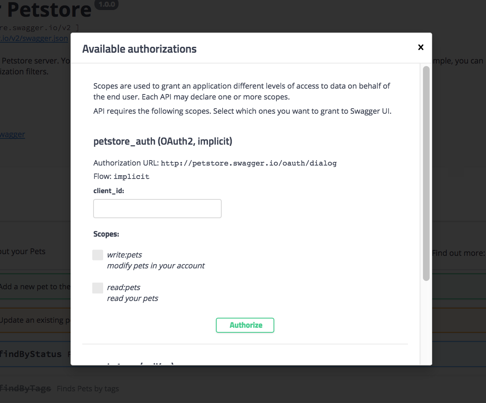
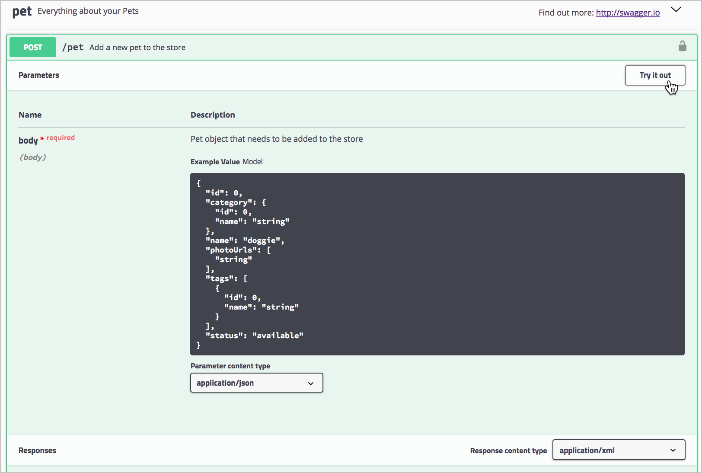
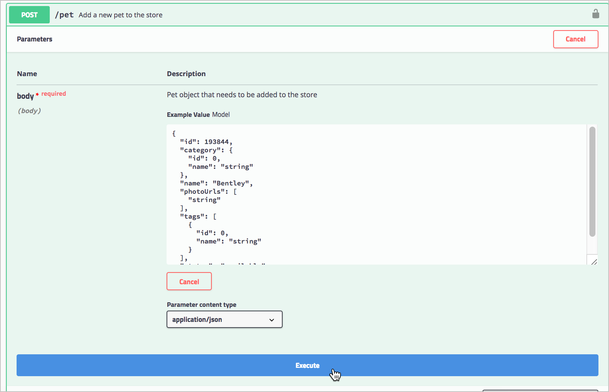
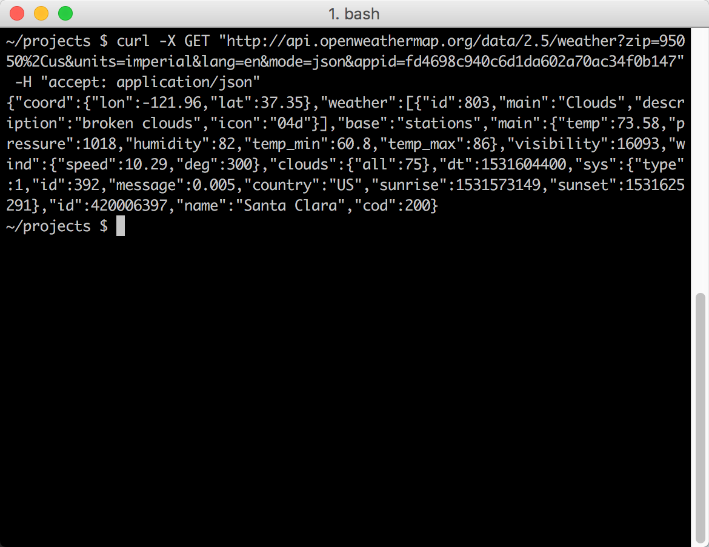
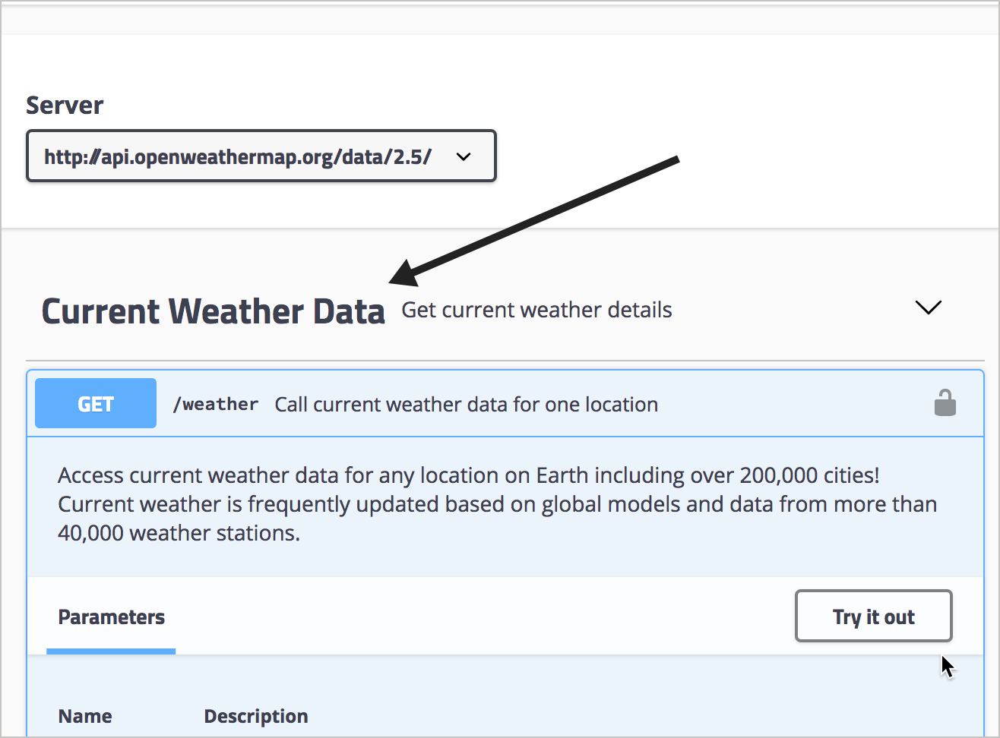
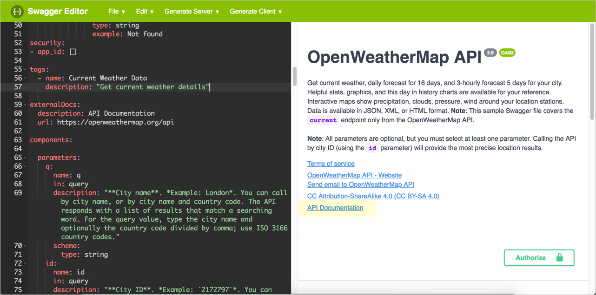
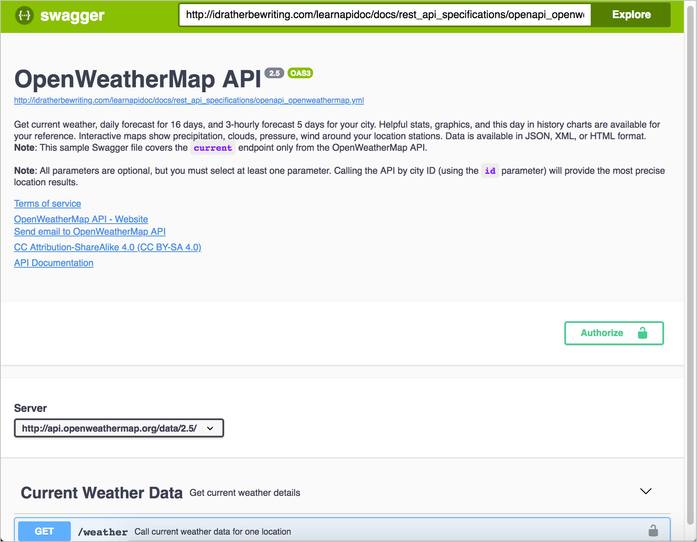

## Корневые объекты в спецификации OpenAPI

> Под «корневым уровнем» подразумевается первый уровень в документе OpenAPI. Этот уровень также называется глобальным уровнем, потому что некоторые свойства объекта, объявленные здесь (а именно, серверы и безопасность), применяются к каждому из объектов операции, если не переопределены на более низком уровне.

На верхнем уровне в спецификации OpenAPI 3.0 существует восемь объектов. Внутри этих верхнеуровневых объектов есть много вложенных объектов, но на верхнем уровне есть только следующие объекты:

- openapi
- info
- servers
- paths
- components
- security
- tags
- externalDocs

Весь документ (объект, содержащий восемь объектов корневого уровня) называется документом OpenAPI. По принятому соглашению  документу присваивают имя **openapi.yml**.

> «OpenAPI» относится к спецификации; «Swagger» относится к инструменту (по крайней мере от Smartbear), который поддерживает спецификацию OpenAPI. Для получения более подробной информации об условиях см. [What Is the Difference Between Swagger and OpenAPI?](https://smartbear.com/blog/develop/what-is-the-difference-between-swagger-and-openapi/)

## Добавляем объект `openapi`

Переходим в редактор Swagger и выбираем **File > Clear editor**. Оставим эту вкладку открытой пока изучаем руководство по OpenAPI, так как будем обновлять документ спецификации с каждым шагом.

Введем первое свойство корневого уровня для документа спецификации: `openapi`. В объекте openapi указываем версию спецификации OpenAPI для проверки. Последняя версия 3.0.2.

```yaml
openapi: "3.0.2"
```


## Представление в Swagger UI

Объект `openapi` не такой большой, и сейчас не хватает контента для проверки спецификации. Но когда мы позже визуализируем свой документ спецификации, мы увидим, что тег «OAS3» появится справа от имени API.


На сервере Swagger UI использует версию спецификации 3.0.2 для проверки вашего контента.

## Пример объекта `info`

Вот пример объекта `info` и его свойств

```yaml
openapi: "3.0.2"
info:
  title: "OpenWeatherMap API"
  description: "Get the current weather, daily forecast for 16 days, and a three-hour-interval forecast for 5 days for your city. Helpful stats, graphics, and this day in history charts are available for your reference. Interactive maps show precipitation, clouds, pressure, wind around your location stations. Data is available in JSON, XML, or HTML format. **Note**: This sample Swagger file covers the `current` endpoint only from the OpenWeatherMap API. <br/><br/> **Note**: All parameters are optional, but you must select at least one parameter. Calling the API by city ID (using the `id` parameter) will provide the most precise location results."
  version: "2.5"
  termsOfService: "https://openweathermap.org/terms"
  contact:
    name: "OpenWeatherMap API"
    url: "https://openweathermap.org/api"
    email: "some_email@gmail.com"
  license:
    name: "CC Attribution-ShareAlike 4.0 (CC BY-SA 4.0)"
    url: "https://openweathermap.org/price"
```

> При описании свойств можно использовать CommonMark Markdown, который  более точен, однозначен и надежен, чем оригинальный Markdown. Например, CommonMark Markdown предлагает обратные слэши и точно определяет, сколько пробелов нужно в списках и других пунктуациях. Также можно переходить на новые строки с помощью `\n` и избегать проблемные символы, такие как кавычки или двоеточия с обратной косой чертой.

При написании контента в свойствах `description`, нужно обратить внимание, что двоеточия являются проблематичными в YAML, потому что они обозначают новые уровни. Либо избегайте двоеточий с обратной косой чертой, либо заключите значение `description` в кавычки. Можно использовать одинарные или двойные кавычки для значений свойств. (Если заключать значения в кавычки, в текстовых редакторах может отображаться подсветка кода свойств и значений.)


## Отображение в Swagger UI

Двигаемся дальше: вставляем код вместе с объектом `openapi` из предыдущего шага в редактор Swagger. В Swagger UI отображены ошибки рендеринга (поскольку в документе спецификации еще нет объектов `path`), но содержимое все равно будет отображаться. (Можно пока свернуть окно ошибок в верхней части нажав `Hide`).

Информация в Swagger UI будет отображаться следующим образом:


В `description`, в дополнение к описанию общего API, можно предоставить пользователям несколько основных инструкций по использованию Swagger UI. Если есть тестовая учетная запись, которую они должны использовать, можно предоставить им необходимую информацию в этом поле.

## Пример объекта `servers`

Пример объекта `servers`

```
servers:
- url: https://api.openweathermap.org/data/2.5/
```

Каждая из конечных точек (называемых в спецификации `paths`) будет добавляться к URL-адресу сервера, при отправке пользователями пробных запросов `Try it out`. Например, если одним из путей является` /weather`, то при отправке запроса Swagger UI представит путь к `{server URL}{path}` 

## Опции URL сервера

Объект `servers` обладает гибкой настройкой. Можно указать несколько URL-адресов серверов, которые могут относиться к различным средам (тестовая, бета-версия, рабочая версия). При наличии нескольких URL-адресов серверов, пользователи могут выбирать среду в раскрывающемся списке серверов. Можно указать несколько URL-адресов серверов, например:

```
servers:
  - url: https://api.openweathermap.org/data/2.5/
        description: Production server
  - url: http://beta.api.openweathermap.org/data/2.5/
        description: Beta server
  - url: http://some-other.api.openweathermap.org/data/2.5/
        description: Some other server
```

В Swagger UI выбор из нескольких серверов осуществляется при помощи выпадающего списка


Если указан один сервер все равно будет отображаться выпадающий список, но с одним вариантом.

В URL-адрес сервера также можно включать переменные, которые будут заполняться сервером во время выполнения. Кроме того, если для разных путей (конечных точек) требуются разные URL-адреса сервера, можно добавить объект `servers` в качестве свойства в объекте операции объекта `path`. URL-адрес локально объявленных серверов переопределяет URL-адрес глобальных серверов.


## 👨‍💻 Отображение в Swagger UI

Вставим объект `servers` (первый пример кода выше, показывающий только один URL) в редактор Swagger, добавив к имеющемуся коду. Swagger UI будет выглядеть следующим образом:


## Объекты `paths`

> Объект `paths` - это та же «конечная точка» в соответствии с терминологии спецификации OpenAPI.

Каждый элемент в объекте `path` содержит объект `operations`. `operations` - это методы GET, POST, PUT и DELETE.

Начинаем с перечисления путей (конечных точек) и их разрешенных операций (методов). Для конечной точки `weather` в API OpenWeatherMap есть только один путь (`/weather`) и одна операция (`get`) для этого пути:

```yaml
paths:
  /weather:
    get:
```

### Объект `operations`

Объект операции ( `get` приведенный выше в коде) содержит различные свойства и объекты:

- `tags`: групповое имя для организации путей в интерфейсе Swagger. Swagger UI сгруппирует конечные точки под заголовками тегов.
- `summary`: краткое описание пути. Swagger UI показывает описание рядом с именем пути. Ограничивают описание только 5-10 словами. Описание отображается и при свернутом разделе.
- `description`: Полное описание пути. Может содержать неограниченное количество деталей. В Swagger UI достаточно места для полного описания.  CommonMark Markdown разрешен.
- `externalDocs` (объект): ссылка на документацию с доп.информацией о пути.
- `operationId`: уникальный идентификатор пути.
- [`parameters`](https://github.com/OAI/OpenAPI-Specification/blob/master/versions/3.0.2.md#parameterObject) (объект): Параметры, принимаемые путем. Не включает параметры тела запроса, которые подробно описаны в объекте `requestBody`. Объект `parameters` также может включать в себя [объект `reference`](https://github.com/OAI/OpenAPI-Specification/blob/master/versions/3.0.2.md#referenceObject), который содержит указатель на описание в объекте `components` (этот объект описан на [шаге 5: Объект `components`](step5-components-object.md) ).
- [`requestBody`](https://github.com/OAI/OpenAPI-Specification/blob/master/versions/3.0.2.md#requestBodyObject) (объект): детали параметра тела запроса для этого пути. Объект `requestBody` также может включать в себя [объект `reference`](https://github.com/OAI/OpenAPI-Specification/blob/master/versions/3.0.2.md#referenceObject), который содержит указатель на описание в объекте `components` (описание в [шаге 5: Объект `components`](step5-components-object.md) ).
- [`response`](https://github.com/OAI/OpenAPI-Specification/blob/master/versions/3.0.2.md#responsesObject) (объект): ответы, предоставленные на запросы по этому пути. Объект `response` также может включать в себя [объект `reference`](https://github.com/OAI/OpenAPI-Specification/blob/master/versions/3.0.2.md#referenceObject), который содержит указатель на описание в объекте `components`. Ответы используют стандартные [коды состояния](https://github.com/OAI/OpenAPI-Specification/blob/master/versions/3.0.2.md#http-status-codes).
- [`callbacks`](https://github.com/OAI/OpenAPI-Specification/blob/master/versions/3.0.2.md#callbackObject) (объект): детали обратного вызова могут быть инициированы сервером при желании. Callbacks - это операции, выполняемые после завершения выполнения функции. Объект `callbacks` также может включать в себя [объект `reference`](https://github.com/OAI/OpenAPI-Specification/blob/master/versions/3.0.2.md#referenceObject), который содержит указатель на описание в объекте `components`.
- `deprecated`: Является ли путь устаревшим. Можно опустить, если вы не хотите указать устаревшее поле. Boolean.
- [`security`](https://github.com/OAI/OpenAPI-Specification/blob/master/versions/3.0.2.md#securityRequirementObject) (объект): Метод безопасной авторизации, используемый с операцией. Этот объект добавляется на уровне пути, только если нужно перезаписать объект `security` на корневом уровне. Имя определяется объектом `securitySchemes` в объекте `components`. Более подробная информация об этом представлена ​​в [шаге 6: объект `security`](step6-security-object.md).
- [`servers`](https://github.com/OAI/OpenAPI-Specification/blob/master/versions/3.0.2.md#serverObject) (объект): Объект `servers`, который может отличаться от [глобального объекта  `servers`](step3-servers-object.md) для этого пути.

Каждое из вышеупомянутых свойств, имеющих гиперссылку и «(объект)», содержат дополнительные уровни. Их значения не просто типы данных, такие как строки, а скорее объекты, которые содержат свои собственные свойства.

> Несомненно, нужно обращаться к [спецификации OpenAPI](https://github.com/OAI/OpenAPI-Specification/blob/master/versions/3.0.2.md), чтобы узнать, какие детали требуются для каждого из значений и объектов. На курсе нет возможности воспроизвести все нужные детали. Здесь просто поверхностное знакомство со свойствами OpenAPI.

Давайте добавим скелет объекта `operations` к нашему коду:

```yaml
paths:
  /weather:
    get:
      tags:
      summary:
      description:
      operationId:
      externalDocs:
      parameters:
      responses:
      deprecated:
      security:
      servers:
      requestBody:
      callbacks:
```

И удалим несколько ненужных полей, которые нам не нужны для нашей документации по API OpenWeatherMap:

- Нет необходимости включать [объект `requestBody`](https://github.com/OAI/OpenAPI-Specification/blob/master/versions/3.0.2.md#requestBodyObject) потому что ни один путь API OpenWeatherMap не содержит параметров тела запроса.
- Нет необходимости включать [объект `servers`](https://github.com/OAI/OpenAPI-Specification/blob/master/versions/3.0.2.md#serverObject) потому что используется тот же URL глобальных `servers`, который мы определили [глобально на корневом уровне](step3-servers-object.md)
- Нет необходимости включать [security](https://github.com/OAI/OpenAPI-Specification/blob/master/versions/3.0.2.md#securityRequirementObject) потому что используется один и тот же объект `security`, который мы определим глобально на корневом уровне позже (см. [Шаг 6: объект `security`](step6-security-object.md) ).
- Нет необходимости включать `deprecated` потому что ни один из путей не устарел.
- Нет необходимости включать `callbacks` потому что ни один из путей не использует колбэки.

В результате мы можем уменьшить количество соответствующих полей до следующего:

```yaml
paths:
  /weather:
    get:
      tags:
      summary:
      description:
      operationId:
      externalDocs:
      parameters:
      responses:
```

Большинство свойств для объектов операции либо требуют простых строк, либо содержат относительно простые объекты. Наиболее подробные объекты здесь - это [объект `parameters`](#parameters) и [объект `responses`](#responses).         

<a name="parameters"></a>
#### Объект `parameters`

[Объект `parameters`](https://github.com/OAI/OpenAPI-Specification/blob/master/versions/3.0.2.md#parameterObject) содержит массив со следующими свойствами:

- `name`: имя параметра.
- `in`: место параметра. Возможные значения: `header`, `path`, `query`, или `cookie`. (Параметры тела запроса здесь не описаны.).
- `description`: описание параметра.
- `required`: требуется ли параметр.
- `deprecated`: является ли параметр устаревшим.
- `allowEmptyValue`: позволяет ли параметр передавать пустое значение.
- `style`: как данные параметра сериализуются (преобразуются в байты во время передачи данных).
- `explode`: расширенный параметр, связанный с массивами.
- `allowReserved`: разрешены ли зарезервированные символы.
- [`schema`](https://github.com/OAI/OpenAPI-Specification/blob/master/versions/3.0.2.md#schemaObject) (объект): Схема или модель для параметра. Схема определяет структуру входных или выходных данных. Обратите внимание, что `schema` также может содержать объект `example`.
- `example`: пример типа носителя. Если объект `example` содержит примеры, эти примеры появляются в Swagger UI, а не в содержимом объекта `example`.
- [`examples`](https://github.com/OAI/OpenAPI-Specification/blob/master/versions/3.0.2.md#exampleObject) (объект): Пример типа носителя, включающий схему.

Вот объект `paths`, который включает детали `parameters`:

```yaml    
paths:
  /weather:
    get:
      tags:
      - Current Weather Data
      summary: "Call current weather data for one location."
      description: "Access current weather data for any location on Earth including over 200,000 cities! Current weather is frequently updated based on global models and data from more than 40,000 weather stations."
      operationId: CurrentWeatherData
      parameters:
      - name: q
        in: query
        description: "**City name**. *Example: London*. You can call by city name, or by city name and country code. The API responds with a list of results that match a searching word. For the query value, type the city name and optionally the country code divided by a comma; use ISO 3166 country codes."
        schema:
          type: string

      - name: id
        in: query
        description: "**City ID**. *Example: `2172797`*. You can call by city ID. The API responds with the exact result. The List of city IDs can be downloaded [here](http://bulk.openweathermap.org/sample/). You can include multiple cities in this parameter &mdash; just separate them by commas. The limit of locations is 20. *Note: A single ID counts as a one API call. So, if you have city IDs, it's treated as 3 API calls.*"
        schema:
          type: string

      - name: lat
        in: query
        description: "**Latitude**. *Example: 35*. The latitude coordinate of the location of your interest. Must use with `lon`."
        schema:
          type: string

      - name: lon
        in: query
        description: "**Longitude**. *Example: 139*. Longitude coordinate of the location of your interest. Must use with `lat`."
        schema:
          type: string

      - name: zip
        in: query
        description: "**Zip code**. Search by zip code. *Example: 95050,us*. Please note that if the country is not specified, the search uses USA as a default."
        schema:
          type: string

      - name: units
        in: query
        description: '**Units**. *Example: imperial*. Possible values: `standard`, `metric`, and `imperial`. When you do not use the `units` parameter, the format is `standard` by default.'
        schema:
          type: string
          enum: [standard, metric, imperial]
          default: "imperial"

      - name: lang
        in: query
        description: '**Language**. *Example: en*. You can use lang parameter to get the output in your language. We support the following languages that you can use with the corresponded lang values: Arabic - `ar`, Bulgarian - `bg`, Catalan - `ca`, Czech - `cz`, German - `de`, Greek - `el`, English - `en`, Persian (Farsi) - `fa`, Finnish - `fi`, French - `fr`, Galician - `gl`, Croatian - `hr`, Hungarian - `hu`, Italian - `it`, Japanese - `ja`, Korean - `kr`, Latvian - `la`, Lithuanian - `lt`, Macedonian - `mk`, Dutch - `nl`, Polish - `pl`, Portuguese - `pt`, Romanian - `ro`, Russian - `ru`, Swedish - `se`, Slovak - `sk`, Slovenian - `sl`, Spanish - `es`, Turkish - `tr`, Ukrainian - `ua`, Vietnamese - `vi`, Chinese Simplified - `zh_cn`, Chinese Traditional - `zh_tw`.'
        schema:
          type: string
          enum: [ar, bg, ca, cz, de, el, en, fa, fi, fr, gl, hr, hu, it, ja, kr, la, lt, mk, nl, pl, pt, ro, ru, se, sk, sl, es, tr, ua, vi, zh_cn, zh_tw]
          default: "en"

      - name: mode
        in: query
        description: "**Mode**. *Example: html*. Determines the format of the response. Possible values are `xml` and `html`. If the mode parameter is empty, the format is `json` by default."
        schema:
          type: string
          enum: [json, xml, html]
          default: "json"
```

<a name="responses"></a>
#### Объект `responses`

Другое существенное свойство в объекте операций - это объект `responses`. Для свойства `responses` обычно ссылаются на полное определение в объекте `components`, поэтому рассказ об объекте `responses` в следующем разделе - [Шаг 5. Объект `components`](step5-components-object.md). (На этом шаге уже слишком много информации.)

На данный момент, чтобы редактор Swagger проверил и показал наш путь, давайте просто добавим некоторый контент-заполнитель для `responses`:

```yaml
responses:
  200:
    description: Successful response
    content:
      application/json:
        schema:
          title: Sample
          type: object
          properties:
            placeholder:
              type: string
              description: Placeholder description

  404:
    description: Not found response
    content:
      text/plain:
        schema:
          title: Weather not found
          type: string
          example: Not found
```

См. [Describing Parameters](https://swagger.io/docs/specification/describing-parameters/) в документации OpenAPI Swagger для более подробной информации.

<a name="paths"></a>
## Код объекта `paths`

Теперь давайте объединим два вышеупомянутых блока кода (и `parameters`, и `responses`) для нашего объекта `paths`. Можем вставить этот код в редактор Swagger, добавляем  наш объект `paths` под кодом `openapi`, `info` и `server`, которые мы добавили в предыдущих уроках.

```yaml
paths:
  /weather:
    get:
      tags:
      - Current Weather Data
      summary: "Call current weather data for one location."
      description: "Access current weather data for any location on Earth including over 200,000 cities! Current weather is frequently updated based on global models and data from more than 40,000 weather stations."
      operationId: CurrentWeatherData
      parameters:
      - name: q
        in: query
        description: "**City name**. *Example: London*. You can call by city name, or by city name and country code. The API responds with a list of results that match a searching word. For the query value, type the city name and optionally the country code divided by a comma; use ISO 3166 country codes."
        schema:
          type: string

      - name: id
        in: query
        description: "**City ID**. *Example: `2172797`*. You can call by city ID. The API responds with the exact result. The List of city IDs can be downloaded [here](http://bulk.openweathermap.org/sample/). You can include multiple cities in this parameter &mdash; just separate them by commas. The limit of locations is 20. *Note: A single ID counts as a one API call. So, if you have city IDs, it's treated as 3 API calls.*"
        schema:
          type: string

      - name: lat
        in: query
        description: "**Latitude**. *Example: 35*. The latitude coordinate of the location of your interest. Must use with `lon`."
        schema:
          type: string

      - name: lon
        in: query
        description: "**Longitude**. *Example: 139*. Longitude coordinate of the location of your interest. Must use with `lat`."
        schema:
          type: string

      - name: zip
        in: query
        description: "**Zip code**. Search by zip code. *Example: 95050,us*. Please note that if the country is not specified, the search uses USA as a default."
        schema:
          type: string

      - name: units
        in: query
        description: '**Units**. *Example: imperial*. Possible values: `standard`, `metric`, and `imperial`. When you do not use the `units` parameter, the format is `standard` by default.'
        schema:
          type: string
          enum: [standard, metric, imperial]
          default: "imperial"

      - name: lang
        in: query
        description: '**Language**. *Example: en*. You can use lang parameter to get the output in your language. We support the following languages that you can use with the corresponded lang values: Arabic - `ar`, Bulgarian - `bg`, Catalan - `ca`, Czech - `cz`, German - `de`, Greek - `el`, English - `en`, Persian (Farsi) - `fa`, Finnish - `fi`, French - `fr`, Galician - `gl`, Croatian - `hr`, Hungarian - `hu`, Italian - `it`, Japanese - `ja`, Korean - `kr`, Latvian - `la`, Lithuanian - `lt`, Macedonian - `mk`, Dutch - `nl`, Polish - `pl`, Portuguese - `pt`, Romanian - `ro`, Russian - `ru`, Swedish - `se`, Slovak - `sk`, Slovenian - `sl`, Spanish - `es`, Turkish - `tr`, Ukrainian - `ua`, Vietnamese - `vi`, Chinese Simplified - `zh_cn`, Chinese Traditional - `zh_tw`.'
        schema:
          type: string
          enum: [ar, bg, ca, cz, de, el, en, fa, fi, fr, gl, hr, hu, it, ja, kr, la, lt, mk, nl, pl, pt, ro, ru, se, sk, sl, es, tr, ua, vi, zh_cn, zh_tw]
          default: "en"

      - name: mode
        in: query
        description: "**Mode**. *Example: html*. Determines the format of the response. Possible values are `xml` and `html`. If the mode parameter is empty, the format is `json` by default."
        schema:
          type: string
          enum: [json, xml, html]
          default: "json"

      responses:
        200:
          description: Successful response
          content:
            application/json:
              schema:
                title: Sample
                type: object
                properties:
                  placeholder:
                    type: string
                    description: Placeholder description

        404:
          description: Not found response
          content:
            text/plain:
              schema:
                title: Weather not found
                type: string
                example: Not found
```

<a name="appearance"></a>
## Отображение в Swagger UI

Отображение `paths` в Swagger UI будет таким:


Чтобы увидеть подробности развернем наш раздел «Current Weather Data». Когда нажмем **Try it out**, вы увидите, что поле заполняется описанием. Если вы хотите, чтобы поле заполнялось значением, добавьте свойство `default`  в схему (как показано с параметром `mode` в приведенном выше коде).

Однако, все параметры не могут быть переданы с одним и тем же запросом - вы используете только те параметры, которые вам нужны для запроса, который вы делаете. (Например, вы не можете передавать почтовый индекс и название города, а также широту / долготу и т.д. в одном запросе.) Поэтому не имеет смысла использовать значения по умолчанию для каждого параметра, поскольку тогда пользователю потребуется удалить большинство из них.

> Swagger UI сворачивает каждый путь по умолчанию. Можно установить, будет ли начальное отображение свернуто или открыто, используя [параметр `docExpansion` в Swagger UI](https://github.com/swagger-api/swagger-ui#parameters). Этот параметр `docExpansion` предназначен для Swagger UI и не является частью спецификации OpenAPI. Swagger UI имеет более [20 различных параметров](https://github.com/swagger-api/swagger-ui#parameters), которые управляют дисплеем. Например, если не хотите, чтобы отображался раздел "Models", нужно добавить параметр `defaultModelsExpandDepth: -1` в файл Swagger UI.

<a name="note"></a>
## Примечание о зависимостях параметров

Спецификация OpenAPI не позволяет объявлять зависимости с параметрами или взаимоисключающими параметрами. В документации Swagger OpenAPI указано:

> OpenAPI 3.0 не поддерживает зависимости параметров и взаимоисключающие параметры. Существует открытый запрос функции по адресу [https://github.com/OAI/OpenAPI-Specification/issues/256](https://github.com/OAI/OpenAPI-Specification/issues/256). Можно задокументировать ограничения в описании параметра и определить логику в ответе 400 Bad Request. ([Parameter Dependencies](https://swagger.io/docs/specification/describing-parameters/#parameter-dependencies-19))

В случае конечной точки погоды с OpenWeatherMap большинство параметров являются взаимоисключающими. Мы не можем выполнять поиск по идентификатору города и почтовому индексу одновременно. Хотя параметры являются необязательными, мы должны использовать хотя бы один параметр. Кроме того, при использовании параметра `lat`, нужно использовать и параметр `lon`, потому что это парные параметры. Спецификация OpenAPI не может программно отражать эту структурированную логику, поэтому мы должны объяснить это в свойстве `description` или в другой, более концептуальной документации.

Объект `components` уникален среди других объектов в спецификации OpenAPI. В `components` хранятся переиспользуемые определения, которые могут появляться в нескольких местах в документе спецификации. В нашем сценарии документации API мы будем хранить детали для объектов `parameters` и `responses` в объекте `components`.

[Причины использования объекта `components`](#reasons)

[Объекты в `components`](#objects)

[Переиспользование параметров в нескольких путях](#reuseParams)

[Переиспользование объектов `responses`](#reuseObjects)

[Описание схемы](#schema)

[Способ обмануть - автоматически генерировать схему из JSON, используя Stoplight](#cheat)

[Использование GUI редакторов для работы с кодом спецификации](#gui)

[Отображение в Swagger UI](#appearanse)

[Раздел Models - почему он существует, как его скрыть](#models)

[Определения `security`](#security)

<a name="reasons"></a>
## Причины использования объекта `components`

Описание деталей параметров и схемы сложных ответов может быть наиболее сложным аспектом спецификации OpenAPI. Хотя можно определить параметры и ответы непосредственно в объектах параметров и ответов, как правило, они не перечисляются там по двум причинам:

- Возможно, будет желание переиспользовать части этих определений в других запросах или ответах. Обычно один и тот же параметр или ответ используется в нескольких местах в API. С помощью объекта `components` OpenAPI позволяет вам повторно использовать одни и те же определения в нескольких местах.
- Возможно, не захочется загромождать свой объект `paths` слишком большим количеством параметров и подробностей ответа, поскольку объект `paths` уже и так сложен из-за нескольких уровней объектов.

Вместо перечисления схемы для ваших запросов и ответов в объекте `paths`, для более сложных схем (или для схем, которые повторно используются в нескольких операциях или путях), используется [объект `reference`](https://github.com/OAI/OpenAPI-Specification/blob/master/versions/3.0.2.md#referenceObject)  (со ссылкой `$ref`), который указывает на конкретное определение в [объекте `components`](https://github.com/OAI/OpenAPI-Specification/blob/master/versions/3.0.2.md#componentsObject). (Подробнее о `$ref` см. В разделе [Использование `$ref`](https://swagger.io/docs/specification/using-ref/).)

Объект `components` можно представить как о приложении к документу, в котором предоставлены данные для повторного использования. Если несколько частей спецификации имеют одну и ту же схему, можно указывать ссылку на один и тот же объект в объекте `components`, и при этом вы получаете единый источник контента. Объект `components` может даже храниться в [отдельном файле](http://apihandyman.io/writing-openapi-swagger-specification-tutorial-part-8-splitting-specification-file/), для более простой организации информации в больших API. (онлайн-редактор Swagger не позволяет использовать несколько файлов для проверки содержимого.)

<a name="objects"></a>
## Объекты в `components`

В объекте `components` можно хранить множество различных переиспользуемых объектов. [Объект `components`](https://github.com/OAI/OpenAPI-Specification/blob/master/versions/3.0.2.md#componentsObject) может содержать следующее:

- [схемы](https://github.com/OAI/OpenAPI-Specification/blob/master/versions/3.0.2.md#schemaObject);
- [ответы](https://github.com/OAI/OpenAPI-Specification/blob/master/versions/3.0.2.md#responses-object);
- [параметры](https://github.com/OAI/OpenAPI-Specification/blob/master/versions/3.0.2.md#parameterObject);
- [примеры](https://github.com/OAI/OpenAPI-Specification/blob/master/versions/3.0.2.md#parameter-object-examples);
- [тело запроса](https://github.com/OAI/OpenAPI-Specification/blob/master/versions/3.0.2.md#requestBodyObject);
- [хэдеры](https://github.com/OAI/OpenAPI-Specification/blob/master/versions/3.0.2.md#headerObject);
- [схемы безопасности](https://github.com/OAI/OpenAPI-Specification/blob/master/versions/3.0.2.md#securitySchemeObject);
- [ссылки](https://github.com/OAI/OpenAPI-Specification/blob/master/versions/3.0.2.md#linkObject);
- [коллбэки](https://github.com/OAI/OpenAPI-Specification/blob/master/versions/3.0.2.md#callbackObject);

Свойства каждого объекта внутри `components` такие же, как и при использовании в других частях спецификации OpenAPI. Используется указатель ссылки (`$ref`), чтобы указать больше деталей в объекте `components`. `$ref` обозначает [объект `reference`](https://github.com/OAI/OpenAPI-Specification/blob/master/versions/3.0.2.md#referenceObject) и является частью JSON.

<a name="reuseParams"></a>
## Переиспользование параметров в нескольких путях

На предыдущем шаге Для параметров мы перечислили все детали непосредственно в объекте `parameters`. Чтобы облегчить переиспользование тех же параметров в других путях, давайте сохраним содержимое `parameters` в `components`. Код ниже показывает, как сделать эти ссылки:

```yaml
paths:
  /weather:
    get:
      tags:
      - Current Weather Data
      summary: "Call current weather data for one location"
      description: "Access current weather data for any location on Earth including over 200,000 cities! Current weather is frequently updated based on global models and data from more than 40,000 weather stations."
      operationId: CurrentWeatherData
      parameters:
        - $ref: '#/components/parameters/q'
        - $ref: '#/components/parameters/id'
        - $ref: '#/components/parameters/lat'
        - $ref: '#/components/parameters/lon'
        - $ref: '#/components/parameters/zip'
        - $ref: '#/components/parameters/units'
        - $ref: '#/components/parameters/lang'
        - $ref: '#/components/parameters/mode'

      responses:
        200:
          description: Successful response
          content:
            application/json:
              schema:
                title: Sample
                type: object
                properties:
                  placeholder:
                    type: string
                    description: Placeholder description

        404:
          description: Not found response
          content:
            text/plain:
              schema:
                title: Weather not found
                type: string
                example: Not found

components:

  parameters:
    q:
      name: q
      in: query
      description: "**City name**. *Example: London*. You can call by city name, or by city name and country code. The API responds with a list of results that match a searching word. For the query value, type the city name and optionally the country code divided by a comma; use ISO 3166 country codes."
      schema:
        type: string
    id:
      name: id
      in: query
      description: "**City ID**. *Example: `2172797`*. You can call by city ID. The API responds with the exact result. The List of city IDs can be downloaded [here](http://bulk.openweathermap.org/sample/). You can include multiple cities in this parameter &mdash; just separate them by commas. The limit of locations is 20. *Note: A single ID counts as a one API call. So, if you have city IDs, it's treated as 3 API calls.*"
      schema:
        type: string

    lat:
      name: lat
      in: query
      description: "**Latitude**. *Example: 35*. The latitude coordinate of the location of your interest. Must use with `lon`."
      schema:
        type: string

    lon:
      name: lon
      in: query
      description: "**Longitude**. *Example: 139*. Longitude coordinate of the location of your interest. Must use with `lat`."
      schema:
        type: string

    zip:
      name: zip
      in: query
      description: "**Zip code**. Search by zip code. *Example: 95050,us*. Please note that if the country is not specified, the search uses USA as a default."
      schema:
        type: string

    units:
      name: units
      in: query
      description: '**Units**. *Example: imperial*. Possible values: `standard`, `metric`, and `imperial`. When you do not use the `units` parameter, the format is `standard` by default.'
      schema:
        type: string
        enum: [standard, metric, imperial]
        default: "imperial"

    lang:
      name: lang
      in: query
      description: '**Language**. *Example: en*. You can use lang parameter to get the output in your language. We support the following languages that you can use with the corresponded lang values: Arabic - `ar`, Bulgarian - `bg`, Catalan - `ca`, Czech - `cz`, German - `de`, Greek - `el`, English - `en`, Persian (Farsi) - `fa`, Finnish - `fi`, French - `fr`, Galician - `gl`, Croatian - `hr`, Hungarian - `hu`, Italian - `it`, Japanese - `ja`, Korean - `kr`, Latvian - `la`, Lithuanian - `lt`, Macedonian - `mk`, Dutch - `nl`, Polish - `pl`, Portuguese - `pt`, Romanian - `ro`, Russian - `ru`, Swedish - `se`, Slovak - `sk`, Slovenian - `sl`, Spanish - `es`, Turkish - `tr`, Ukrainian - `ua`, Vietnamese - `vi`, Chinese Simplified - `zh_cn`, Chinese Traditional - `zh_tw`.'
      schema:
        type: string
        enum: [ar, bg, ca, cz, de, el, en, fa, fi, fr, gl, hr, hu, it, ja, kr, la, lt, mk, nl, pl, pt, ro, ru, se, sk, sl, es, tr, ua, vi, zh_cn, zh_tw]
        default: "en"

    mode:
      name: mode
      in: query
      description: "**Mode**. *Example: html*. Determines the format of the response. Possible values are `xml` and `html`. If the mode parameter is empty, the format is `json` by default."
      schema:
        type: string
        enum: [json, xml, html]
        default: "json"
```
Заменим существующий объект `paths` в редакторе Swagger приведенным выше примером кода, включив новый объект `components` и обратим внимание, что отображаемое изображение по-прежнему выглядит так же.              

<a name="reuseObjects"></a>
## Переиспользование объектов `responses`

В [шаге 4: объект `paths`](step4-paths-object.md), когда мы описывали [объект `responses`](step4-paths-object.md#responses) в объекте `paths`, даже с помощью простого заполнителя, мы использовали [объект `schema`](https://github.com/OAI/OpenAPI-Specification/blob/master/versions/3.0.2.md#schemaObject) для описания модели запроса или ответа. `schema` относится к структуре данных (поля, значения и иерархия различных объектов и свойств объекта JSON или YAML - см. [Что такое схема?](https://json-schema.org/understanding-json-schema/about.html)).

Давайте поглубже изучим то, как использовать свойства схемы для документирования объекта `response`. Мы также будем хранить  содержимое схемы в `components`, чтобы его можно было повторно использовать в других частях документа спецификации. Если вспомнить [предыдущий шаг](step4-paths-object.md), объект ответов для конечной точки погоды выглядел так:

```yaml
paths:
  /current:
    get:
      parameters:

      ...

      responses:
        200:
          description: Successful response
          content:
            application/json:
              schema:
                title: Sample
                type: object
                properties:
                  placeholder:
                    type: string
                    description: Placeholder description

        404:
          description: Not found response
          content:
            text/plain:
              schema:
                title: Weather not found
                type: string
                example: Not found
```

Перенесем описание `schema` для ответа `200` в объект `components`:

```yaml
paths:
  /weather:
    get:
      tags:
      - Current Weather Data
      summary: "Call current weather data for one location"
      description: "Access current weather data for any location on Earth including over 200,000 cities! Current weather is frequently updated based on global models and data from more than 40,000 weather stations."
      operationId: CurrentWeatherData
      parameters:
        - $ref: '#/components/parameters/q'
        - $ref: '#/components/parameters/id'
        - $ref: '#/components/parameters/lat'
        - $ref: '#/components/parameters/lon'
        - $ref: '#/components/parameters/zip'
        - $ref: '#/components/parameters/units'
        - $ref: '#/components/parameters/lang'
        - $ref: '#/components/parameters/mode'

      responses:
        200:
          description: Successful response
          content:
            application/json:
              schema:
                $ref: '#/components/schemas/200'
        404:
          description: Not found response
          content:
            text/plain:
              schema:
                title: Weather not found
                type: string
                example: Not found
```

Затем в `components/schemas` мы определим схему `200`.

Прежде чем мы опишем ответ в объекте `components`, может быть полезно посмотреть, как выглядит ответ `weather` от API OpenWeatherMap. Ответ JSON содержит несколько вложенных объектов на разных уровнях.

```json
{
  "coord": {
    "lon": 145.77,
    "lat": -16.92
  },
  "weather": [
    {
      "id": 803,
      "main": "Clouds",
      "description": "broken clouds",
      "icon": "04n"
    }
  ],
  "base": "cmc stations",
  "main": {
    "temp": 293.25,
    "pressure": 1019,
    "humidity": 83,
    "temp_min": 289.82,
    "temp_max": 295.37,
    "sea_level": 984,
    "grnd_level": 990
  },
  "wind": {
    "speed": 5.1,
    "deg": 150
  },
  "clouds": {
    "all": 75
  },
  "rain": {
    "3h": 3
  },
  "snow": {
    "3h": 6
  },
  "dt": 1435658272,
  "sys": {
    "type": 1,
    "id": 8166,
    "message": 0.0166,
    "country": "AU",
    "sunrise": 1435610796,
    "sunset": 1435650870
  },
  "id": 2172797,
  "name": "Cairns",
  "cod": 200
}
```

Существует несколько способов описания этого ответа. Можно создать длинное описание, содержащее всю отраженную иерархию. Однако одной из проблем такого подхода является то, что трудно поддерживать все уровни на одном уровне. С таким количеством вложенных объектов это головокружительно запутанно. Кроме того, легко ошибиться. Хуже всего то, что нельзя переиспользовать отдельные объекты. В первую очередь это подрывает одну из основных причин хранения этого объекта в `components`.    

Другой подход заключается в том, чтобы сделать каждый объект своей сущностью в `components`. Когда объект содержит объект, добавьте значение `$ref`, которое указывает на новый объект. Таким образом, объекты остаются неглубокими (вместо нескольких уровней вложенности), и мы не потеряемся в море запутанных подуровней. (Если подобъекта нет, просто предоставим описание напрямую, без использования `$ref`.

Вот описание ответа `200` для конечной точки `weather`. Я включил тег `paths` для поддержания контекста:

Объект `responses` с документацией `components`:

```yaml
paths:
  /weather:
    get:
      tags:
      - Current Weather Data
      summary: "Call current weather data for one location"
      description: "Access current weather data for any location on Earth including over 200,000 cities! Current weather is frequently updated based on global models and data from more than 40,000 weather stations."
      operationId: CurrentWeatherData
      parameters:
        - $ref: '#/components/parameters/q'
        - $ref: '#/components/parameters/id'
        - $ref: '#/components/parameters/lat'
        - $ref: '#/components/parameters/lon'
        - $ref: '#/components/parameters/zip'
        - $ref: '#/components/parameters/units'
        - $ref: '#/components/parameters/lang'
        - $ref: '#/components/parameters/mode'

      responses:
        200:
          description: Successful response
          content:
            application/json:
              schema:
                $ref: '#/components/schemas/200'
        404:
          description: Not found response
          content:
            text/plain:
              schema:
                title: Weather not found
                type: string
                example: Not found

components:

  parameters:
    # not shown for the sake of brevity -- see the earlier code block for details
    ...

  schemas:
    200:
      title: Successful response
      type: object
      properties:
        coord:
          $ref: '#/components/schemas/Coord'
        weather:
          type: array
          items:
            $ref: '#/components/schemas/Weather'
          description: (more info Weather condition codes)
        base:
          type: string
          description: Internal parameter
          example: cmc stations
        main:
          $ref: '#/components/schemas/Main'
        visibility:
          type: integer
          description: Visibility, meter
          example: 16093
        wind:
          $ref: '#/components/schemas/Wind'
        clouds:
          $ref: '#/components/schemas/Clouds'
        rain:
          $ref: '#/components/schemas/Rain'
        snow:
          $ref: '#/components/schemas/Snow'
        dt:
          type: integer
          description: Time of data calculation, unix, UTC
          format: int32
          example: 1435658272
        sys:
          $ref: '#/components/schemas/Sys'
        id:
          type: integer
          description: City ID
          format: int32
          example: 2172797
        name:
          type: string
          example: Cairns
        cod:
          type: integer
          description: Internal parameter
          format: int32
          example: 200
    Coord:
      title: Coord
      type: object
      properties:
        lon:
          type: number
          description: City geo location, longitude
          example: 145.77000000000001
        lat:
          type: number
          description: City geo location, latitude
          example: -16.920000000000002
    Weather:
      title: Weather
      type: object
      properties:
        id:
          type: integer
          description: Weather condition id
          format: int32
          example: 803
        main:
          type: string
          description: Group of weather parameters (Rain, Snow, Extreme etc.)
          example: Clouds
        description:
          type: string
          description: Weather condition within the group
          example: broken clouds
        icon:
          type: string
          description: Weather icon id
          example: 04n
    Main:
      title: Main
      type: object
      properties:
        temp:
          type: number
          description: 'Temperature. Unit Default: Kelvin, Metric: Celsius, Imperial: Fahrenheit.'
          example: 293.25
        pressure:
          type: integer
          description: Atmospheric pressure (on the sea level, if there is no sea_level or grnd_level data), hPa
          format: int32
          example: 1019
        humidity:
          type: integer
          description: Humidity, %
          format: int32
          example: 83
        temp_min:
          type: number
          description: 'Minimum temperature at the moment. This is deviation from current temp that is possible for large cities and megalopolises geographically expanded (use these parameter optionally). Unit Default: Kelvin, Metric: Celsius, Imperial: Fahrenheit.'
          example: 289.81999999999999
        temp_max:
          type: number
          description: 'Maximum temperature at the moment. This is deviation from current temp that is possible for large cities and megalopolises geographically expanded (use these parameter optionally). Unit Default: Kelvin, Metric: Celsius, Imperial: Fahrenheit.'
          example: 295.37
        sea_level:
          type: number
          description: Atmospheric pressure on the sea level, hPa
          example: 984
        grnd_level:
          type: number
          description: Atmospheric pressure on the ground level, hPa
          example: 990
    Wind:
      title: Wind
      type: object
      properties:
        speed:
          type: number
          description: 'Wind speed. Unit Default: meter/sec, Metric: meter/sec, Imperial: miles/hour.'
          example: 5.0999999999999996
        deg:
          type: integer
          description: Wind direction, degrees (meteorological)
          format: int32
          example: 150
    Clouds:
      title: Clouds
      type: object
      properties:
        all:
          type: integer
          description: Cloudiness, %
          format: int32
          example: 75
    Rain:
      title: Rain
      type: object
      properties:
        3h:
          type: integer
          description: Rain volume for the last 3 hours
          format: int32
          example: 3
    Snow:
      title: Snow
      type: object
      properties:
        3h:
          type: number
          description: Snow volume for the last 3 hours
          example: 6
    Sys:
      title: Sys
      type: object
      properties:
        type:
          type: integer
          description: Internal parameter
          format: int32
          example: 1
        id:
          type: integer
          description: Internal parameter
          format: int32
          example: 8166
        message:
          type: number
          description: Internal parameter
          example: 0.0166
        country:
          type: string
          description: Country code (GB, JP etc.)
          example: AU
        sunrise:
          type: integer
          description: Sunrise time, unix, UTC
          format: int32
          example: 1435610796
        sunset:
          type: integer
          description: Sunset time, unix, UTC
          format: int32
          example: 1435650870    
```

Пояснение, как описать ответ будет в следующих разделах. Взглянув на приведенный выше код, стало заметно, что можно использовать не только свойства `$ref` в других частях вашей спецификации, но и внутри `components`.            

> Обратите внимание, как определение схемы включает в себя свойство `example` для каждого элемента? Swagger UI возьмет этот `example` и использует его для динамического построения полного образца кода в секции «Ответы» в выводе пользовательского интерфейса Swagger. Таким образом, не нужны большие куски кода для примеров ответов в нашей спецификации. Вместо этого эти примеры ответов создаются автоматически из схемы. Это одна из приятных вещей в Swagger UI. Таким образом, документация схемы и пример ответа остаются консистентными.

<a name="schema"></a>
## Описание схемы

Для большинства разделов в `components` описаниям объектов тем же, что подробно описаны в остальной части спецификации. При описании объекта `schema` используются стандартные ключевые слова и термины из [схемы JSON](http://json-schema.org/), в частности из [спецификации JSON Schema Wright Draft 00](https://tools.ietf.org/html/draft-wright-json-schema-00).

Другими словами, мы не просто используем термины, определенные в спецификации OpenAPI, для описания моделей вашего JSON. При описании своей модели JSON (структуры данных для входных и выходных объектов), терминология в спецификации OpenAPI вводится в более широкие определения JSON и язык описания для моделирования JSON. Использование OpenAPI схемы JSON является лишь подмножеством полной схемы JSON.

Спецификация OpenAPI не пытается документировать, как моделировать схемы JSON. Это было бы излишним, т.к. уже все задокументировано на сайте [схемы JSON](http://json-schema.org/) и выходило бы за рамки спецификации OpenAPI. Поэтому может понадобиться обратиться к [схеме JSON](http://json-schema.org/) для получения более подробной информации. (Еще одно полезное руководство - [Расширенные данные](http://apihandyman.io/writing-openapi-swagger-specification-tutorial-part-4-advanced-data-modeling/) из API Handyman.)

Для описания JSON объектов можно использовать следующие идентификаторы:

- `title`;
- `multipleOf`;
- `maximum`;
- `exclusiveMaximum`;
- `minimum`;
- `exclusiveMinimum`;
- `maxLength`;
- `minLength`;
- `pattern`;
- `maxItems`;
- `minItems`;
- `uniqueItems`;
- `maxProperties`;
- `minProperties`;
- `required`;
- `enum`;
- `type`;
- `allOf`;
- `oneOf`;
- `anyOf`;
- `not`;
- `items`;
- `properties`;
- `additionalProperties`;
- `description`;
- `format`;
- `default`

Доступные [типы данных](https://github.com/OAI/OpenAPI-Specification/blob/master/versions/3.0.2.md#data-types):

- `integer`;
- `long`;
- `float`;
- `double`;
- `string`;
- `byte`;
- `binary`;
- `boolean`;
- `date`;
- `dateTime`;
- `password`.

При документировании схемы, лучше начинать с просмотра [объекта `schema`](https://github.com/OAI/OpenAPI-Specification/blob/master/versions/3.0.2.md#schemaObject) OpenAPI, а потом, если что-то не покрыто, обратиться к [схеме JSON](https://tools.ietf.org/html/draft-wright-json-schema-00).

Кроме того, посмотрите на некоторые примеры схем. Вы можете посмотреть [примеры 3.0 здесь](https://github.com/OAI/OpenAPI-Specification/tree/master/examples/v3.0). Обычно находят подходящую спецификацию, и имитируют те же свойства и структуру.

> Объект `schema` в версии 3.0 немного отличается от объекта схемы в версии 2.0 - см. [статью о скандинавских API](https://nordicapis.com/whats-new-in-openapi-3-0/#jsonandotherschema) чтобы понять новинки. Тем не менее, примеры схем из  [спецификаций 2.0](https://github.com/OAI/OpenAPI-Specification/tree/master/examples/v2.0) (которые более распространены в сети), также будут полезны, если просто посмотреть на определения схемы, а не на остальную часть спецификации.

<a name="cheat"></a>
## Способ обмануть - автоматически генерировать схему из JSON, используя Stoplight

Описание ответа JSON бывает сложным и запутанным. К счастью, есть несколько простой обходной путь. Можно загрузить [Stoplight](https://next.stoplight.io/) и использовать функцию **Generate JSON**, чтобы Stoplight автоматически создавал описание схемы OpenAPI. Вот ссылка на короткое видео, показывающее, как это сделать:

[](https://youtu.be/0IOWY0Hj3Xc)

По сути, в редактор Stoplight копируется JSON-ответ, который нужно задокументировать. Затем надо нажать `Generate JSON`. Перейти в представление кода и скопировать JSON. Затем сконвертировать JSON в YAML с помощью онлайн-конвертера. Для получения дополнительной информации см. [Stoplight - инструменты визуального моделирования для создания спецификации OpenAPI.](stoplight.md)

Единственная загвоздка в том, что Stoplight использует OpenAPI 2.0, а не 3.0. Возможно, придется использовать API Transformer для преобразования вывода схемы 2.0 в 3.0. Несмотря на это, такой подход может сэкономить много времени.

<a name="gui"></a>
## Использование GUI редакторов для работы с кодом спецификации

На данный момент наверное, есть мысли, насколько будет непрактично и подвержено ошибкам, поскольку работа непосредственно с кодом YAML. По этой причине несколько компаний разработали графические редакторы, чтобы упростить работу с кодом спецификации. В частности, обратите внимание на [Stoplight](stoplight.md), который предоставляет редактор, позволяющий переключаться между кодом и графическим интерфейсом. Smartbear также предлагает [SwaggerHub](swaggerhub-introduction-and-tutorial.md), который не обязательно предоставляет графический интерфейс, но предоставляет встроенные инструменты комментирования и управления версиями.

<a name="appearanse"></a>
## Отображение в Swagger UI

Скопируем код ниже и вставим его в редактор Swagger после объектов `openapi`, `info` и `servers`

```yaml
paths:
  /weather:
    get:
      tags:
      - Current Weather Data
      summary: "Call current weather data for one location"
      description: "Access current weather data for any location on Earth including over 200,000 cities! Current weather is frequently updated based on global models and data from more than 40,000 weather stations."
      operationId: CurrentWeatherData
      parameters:
        - $ref: '#/components/parameters/q'
        - $ref: '#/components/parameters/id'
        - $ref: '#/components/parameters/lat'
        - $ref: '#/components/parameters/lon'
        - $ref: '#/components/parameters/zip'
        - $ref: '#/components/parameters/units'
        - $ref: '#/components/parameters/lang'
        - $ref: '#/components/parameters/mode'

      responses:
        200:
          description: Successful response
          content:
            application/json:
              schema:
                $ref: '#/components/schemas/200'
        404:
          description: Not found response
          content:
            text/plain:
              schema:
                title: Weather not found
                type: string
                example: Not found

components:

  parameters:
    q:
      name: q
      in: query
      description: "**City name**. *Example: London*. You can call by city name, or by city name and country code. The API responds with a list of results that match a searching word. For the query value, type the city name and optionally the country code divided by a comma; use ISO 3166 country codes."
      schema:
        type: string
    id:
      name: id
      in: query
      description: "**City ID**. *Example: `2172797`*. You can call by city ID. The API responds with the exact result. The List of city IDs can be downloaded [here](http://bulk.openweathermap.org/sample/). You can include multiple cities in this parameter &mdash; just separate them by commas. The limit of locations is 20. *Note: A single ID counts as a one API call. So, if you have city IDs, it's treated as 3 API calls.*"
      schema:
        type: string

    lat:
      name: lat
      in: query
      description: "**Latitude**. *Example: 35*. The latitude coordinate of the location of your interest. Must use with `lon`."
      schema:
        type: string

    lon:
      name: lon
      in: query
      description: "**Longitude**. *Example: 139*. Longitude coordinate of the location of your interest. Must use with `lat`."
      schema:
        type: string

    zip:
      name: zip
      in: query
      description: "**Zip code**. Search by zip code. *Example: 95050,us*. Please note that if the country is not specified, the search uses USA as a default."
      schema:
        type: string

    units:
      name: units
      in: query
      description: '**Units**. *Example: imperial*. Possible values: `standard`, `metric`, and `imperial`. When you do not use the `units` parameter, the format is `standard` by default.'
      schema:
        type: string
        enum: [standard, metric, imperial]
        default: "imperial"

    lang:
      name: lang
      in: query
      description: '**Language**. *Example: en*. You can use lang parameter to get the output in your language. We support the following languages that you can use with the corresponded lang values: Arabic - `ar`, Bulgarian - `bg`, Catalan - `ca`, Czech - `cz`, German - `de`, Greek - `el`, English - `en`, Persian (Farsi) - `fa`, Finnish - `fi`, French - `fr`, Galician - `gl`, Croatian - `hr`, Hungarian - `hu`, Italian - `it`, Japanese - `ja`, Korean - `kr`, Latvian - `la`, Lithuanian - `lt`, Macedonian - `mk`, Dutch - `nl`, Polish - `pl`, Portuguese - `pt`, Romanian - `ro`, Russian - `ru`, Swedish - `se`, Slovak - `sk`, Slovenian - `sl`, Spanish - `es`, Turkish - `tr`, Ukrainian - `ua`, Vietnamese - `vi`, Chinese Simplified - `zh_cn`, Chinese Traditional - `zh_tw`.'
      schema:
        type: string
        enum: [ar, bg, ca, cz, de, el, en, fa, fi, fr, gl, hr, hu, it, ja, kr, la, lt, mk, nl, pl, pt, ro, ru, se, sk, sl, es, tr, ua, vi, zh_cn, zh_tw]
        default: "en"

    mode:
      name: mode
      in: query
      description: "**Mode**. *Example: html*. Determines the format of the response. Possible values are `xml` and `html`. If the mode parameter is empty, the format is `json` by default."
      schema:
        type: string
        enum: [json, xml, html]
        default: "json"

  schemas:
    200:
      title: Successful response
      type: object
      properties:
        coord:
          $ref: '#/components/schemas/Coord'
        weather:
          type: array
          items:
            $ref: '#/components/schemas/Weather'
          description: (more info Weather condition codes)
        base:
          type: string
          description: Internal parameter
          example: cmc stations
        main:
          $ref: '#/components/schemas/Main'
        visibility:
          type: integer
          description: Visibility, meter
          example: 16093
        wind:
          $ref: '#/components/schemas/Wind'
        clouds:
          $ref: '#/components/schemas/Clouds'
        rain:
          $ref: '#/components/schemas/Rain'
        snow:
          $ref: '#/components/schemas/Snow'
        dt:
          type: integer
          description: Time of data calculation, unix, UTC
          format: int32
          example: 1435658272
        sys:
          $ref: '#/components/schemas/Sys'
        id:
          type: integer
          description: City ID
          format: int32
          example: 2172797
        name:
          type: string
          example: Cairns
        cod:
          type: integer
          description: Internal parameter
          format: int32
          example: 200
    Coord:
      title: Coord
      type: object
      properties:
        lon:
          type: number
          description: City geo location, longitude
          example: 145.77000000000001
        lat:
          type: number
          description: City geo location, latitude
          example: -16.920000000000002
    Weather:
      title: Weather
      type: object
      properties:
        id:
          type: integer
          description: Weather condition id
          format: int32
          example: 803
        main:
          type: string
          description: Group of weather parameters (Rain, Snow, Extreme etc.)
          example: Clouds
        description:
          type: string
          description: Weather condition within the group
          example: broken clouds
        icon:
          type: string
          description: Weather icon id
          example: 04n
    Main:
      title: Main
      type: object
      properties:
        temp:
          type: number
          description: 'Temperature. Unit Default: Kelvin, Metric: Celsius, Imperial: Fahrenheit.'
          example: 293.25
        pressure:
          type: integer
          description: Atmospheric pressure (on the sea level, if there is no sea_level or grnd_level data), hPa
          format: int32
          example: 1019
        humidity:
          type: integer
          description: Humidity, %
          format: int32
          example: 83
        temp_min:
          type: number
          description: 'Minimum temperature at the moment. This is deviation from current temp that is possible for large cities and megalopolises geographically expanded (use these parameter optionally). Unit Default: Kelvin, Metric: Celsius, Imperial: Fahrenheit.'
          example: 289.81999999999999
        temp_max:
          type: number
          description: 'Maximum temperature at the moment. This is deviation from current temp that is possible for large cities and megalopolises geographically expanded (use these parameter optionally). Unit Default: Kelvin, Metric: Celsius, Imperial: Fahrenheit.'
          example: 295.37
        sea_level:
          type: number
          description: Atmospheric pressure on the sea level, hPa
          example: 984
        grnd_level:
          type: number
          description: Atmospheric pressure on the ground level, hPa
          example: 990
    Wind:
      title: Wind
      type: object
      properties:
        speed:
          type: number
          description: 'Wind speed. Unit Default: meter/sec, Metric: meter/sec, Imperial: miles/hour.'
          example: 5.0999999999999996
        deg:
          type: integer
          description: Wind direction, degrees (meteorological)
          format: int32
          example: 150
    Clouds:
      title: Clouds
      type: object
      properties:
        all:
          type: integer
          description: Cloudiness, %
          format: int32
          example: 75
    Rain:
      title: Rain
      type: object
      properties:
        3h:
          type: integer
          description: Rain volume for the last 3 hours
          format: int32
          example: 3
    Snow:
      title: Snow
      type: object
      properties:
        3h:
          type: number
          description: Snow volume for the last 3 hours
          example: 6
    Sys:
      title: Sys
      type: object
      properties:
        type:
          type: integer
          description: Internal parameter
          format: int32
          example: 1
        id:
          type: integer
          description: Internal parameter
          format: int32
          example: 8166
        message:
          type: number
          description: Internal parameter
          example: 0.0166
        country:
          type: string
          description: Country code (GB, JP etc.)
          example: AU
        sunrise:
          type: integer
          description: Sunrise time, unix, UTC
          format: int32
          example: 1435610796
        sunset:
          type: integer
          description: Sunset time, unix, UTC
          format: int32
          example: 1435650870

  securitySchemes:
    app_id:
      type: apiKey
      description: API key to authorize requests. If you don't have an OpenWeatherMap API key, use `fd4698c940c6d1da602a70ac34f0b147`.
      name: appid
      in: query
```

В Swagger UI мы увидим следующее:



> Объект `Responses` объявлен в `components`

В секции  `Responses` просмотрим, как код Example Value был динамически построен из значений `example` в схеме, чтобы показать пример ответа.

А еще, кликнем ссылку **Model** , чтобы увидеть, как описания каждого элемента отображаются в развертываемом / раскладываемом виде:



> Отображение описания в Model

<a name="models"></a>
## Раздел Models - почему он существует, как его скрыть

Под всеми эндпоинтами расположен раздел «Модели»:



По умолчанию Swagger UI отображает каждый объект из `components` в разделе «Модели» в конце интерфейса Swagger UI. Если объединить все схемы в один объект, не используя свойство `$ref` для указания на новые объекты, то будет виден только один объект в моделях. Если разделить объекты, то будет виден каждый объект, перечисленный отдельно, включая объект, который содержит все ссылки.

Для переиспользования объектов, определяем каждый объект в `components` отдельно. В результате раздел Модели выглядит как на картинке выше


Почему здесь есть раздел моделей? По-видимому, он был добавлен по популярному запросу, потому что онлайн-редактор Swagger показывал дисплей, и многие пользователи просили включить его в интерфейс Swagger.

Раздел «Модели» не нужен в Swagger UI, поскольку в разделах «Запрос» и «Ответ» пользовательского интерфейса Swagger имеется ссылка «Модель», которая позволяет пользователю переключаться в это представление.

Чтобы скрыть раздел «Модели» можно добавить параметр `defaultModelsExpandDepth: -1` в проект Swagger UI. В этом модуле есть раздел [Руководство Swagger UI](swagger-ui-tutorial.md), в котором подробно описаны параметры Swagger UI, в которых можно настроить этот параметр.

<a name="security"></a>
## Определения `security`

Объект `components` также содержит [объект `securitySchemes`](https://github.com/OAI/OpenAPI-Specification/blob/master/versions/3.0.2.md#securitySchemeObject), который определяет метод авторизации, используемый с каждым путем. Не будем углубляться в детали конфигурации безопасности, исследуем `security` на [шаге 6: объект `security`](step6-security-object.md).


## Объект `security`

На корневом уровне документа OpenAPI добавим объект `security`, который определяет глобальный метод безопасности API:

```yaml
security:
- app_id: []
```

`app_id` - произвольное имя, которое мы дали этой схеме безопасности в нашем объекте `securitySchemes`. Мы могли бы назвать ее как угодно. Мы определим `app_id` в `components`.

Все пути будут использовать метод безопасности `app_id` по умолчанию, если он не переопределен значением на [уровне объекта `path`](step4-paths-object.md). Например, на уровне пути мы могли бы перезаписать метод глобальной безопасности следующим образом:

```yaml
/current:
  get:
    ...
    security:
    - some_other_key: []
```

Тогда путь `weather` будет использовать метод безопасности `some_other_key`, в то время как все другие пути будут использовать глобально объявленную безопасность `app_id`.

<a name="schmenaInComponents"></a>
## Ссылка на схему безопасности в компонентах

В [объекте `components`](step5-components-object.md) добавим [объект `securitySchemes`](https://github.com/OAI/OpenAPI-Specification/blob/master/versions/3.0.2.md#securitySchemeObject), который определяет подробности о схеме безопасности, которую использует API:

```yaml
components:
  ...

  securitySchemes:
    app_id:
      type: apiKey
      description: API key to authorize requests. If you don't have an OpenWeatherMap API key, use `fd4698c940c6d1da602a70ac34f0b147`.
      name: appid
      in: query
```

Свойства, которые можно использовать для каждого элемента в объекте `securitySchemes`, включают следующее:

- `type`: протокол авторизации - `apiKey`, `http`, `oath2` или `openIdConnect`.
- `description`: Описание метода безопасности. В Swagger UI это описание появляется в модальном окне авторизации (см. Скриншот ниже). CommonMark Markdown разрешена.
- `name`: Имя значения заголовка, представленного в запросе. Используется только для безопасности типа `apiKey`.
- `in`: Указывает, где применяется ключ безопасности. Варианты: `query`, `header` или `cookie`. Используется только для безопасности типа `apiKey`.
- `scheme`: Используется с авторизацией типа `http`.
- `bearerFormat`: Используется с авторизацией типа `http`.
- [объект `flow`](https://github.com/OAI/OpenAPI-Specification/blob/master/versions/3.0.2.md#oauthFlowsObject): Используется с авторизацией типа `oath2`
- `openIdConnectUrl`: Используется с авторизацией типа `openIdConnect`

<a name="appearanse"></a>
## Отображение в Swagger UI

В редакторе Swagger, если еще не указано, добавим объект `security` на корневом уровне:

```yaml
security:
    - app_id: []
```

И вставим объект `securitySchemes` в объект `components` (на том же уровне, что и `parameters` и `responses`):

```yaml
components:
  parameters:
  ...
  responses:
  ...

  securitySchemes:
    app_id:
      type: apiKey
      description: API key to authorize requests. If you don't have an OpenWeatherMap API key, use `fd4698c940c6d1da602a70ac34f0b147`.
      name: appid
      in: query
```

И проверим, как изменился наш Swagger UI в правой части: появилась кнопка `Authorize`


>Добавление в спецификацию информации о безопасности

Если нажать на кнопку, то появится `description` и другие детали авторизации:


После ввода ключа API ([Ключ мы получали во втором модуле](../like-developer/get-authorization-keys.md#key) ) и нажатия кнопки `Authorize` метод авторизации устанавливается для любого количества запросов. Сессия авторизации истекает только тогда, когда пользователи обновляют страницу.

<a name="test"></a>
## Тест авторизации

Теперь, когда мы добавили авторизацию, попробуем сделать фактический запрос API. В редакторе Swagger (правая панель) нажмите кнопку `Authorize`, вставляем образец ключа API, показанного в описании, в поле **Value** (или используйте свой собственный ключ API OpenWeatherMap) и нажимаем `Authorize`. После чего кликаем `Close` , чтобы закрыть окно авторизации.

В разделе «Current Weather Data» разворачиваем конечную точку погоды GET и кликаем `Try it out`. В поле почтовый индекс введем свой почтовый индекс и сокращение страны (например, 95050, США), а затем нажмите `Execute`.

При выполнении запроса, Swagger UI показывает отправленный запрос. Например, после выполнения запроса погоды, curl выглядит следующим образом:

```json
    curl -X GET "https://api.openweathermap.org/data/2.5/weather?zip=95050%2Cus&units=imperial&lang=en&mode=json&appid=fd4698c940c6d1da602a70ac34f0b147" -H "accept: application/json"
```

`&Appid = fd4698c940c6d1da602a70ac34f0b147` "указывает, что ключ API включается в строку запроса, поэтому запрос будет авторизован. Если вы скопируете отправленный curl и вставите его в командную строку, вы увидите успешный ответ:



> Успешный curl response

Ответ сервера также отображается непосредственно в Swagger UI со ссылкой для его загрузки:

```json
{
  "coord": {
    "lon": -121.96,
    "lat": 37.35
  },
  "weather": [
    {
      "id": 500,
      "main": "Rain",
      "description": "light rain",
      "icon": "10d"
    },
    {
      "id": 701,
      "main": "Mist",
      "description": "mist",
      "icon": "50d"
    }
  ],
  "base": "stations",
  "main": {
    "temp": 55.24,
    "pressure": 1012,
    "humidity": 77,
    "temp_min": 51.08,
    "temp_max": 59
  },
  "visibility": 16093,
  "wind": {
    "speed": 5.82,
    "deg": 320
  },
  "rain": {
    "1h": 0.25
  },
  "clouds": {
    "all": 40
  },
  "dt": 1544039760,
  "sys": {
    "type": 1,
    "id": 5122,
    "message": 0.0052,
    "country": "US",
    "sunrise": 1544022470,
    "sunset": 1544057391
  },
  "id": 420006397,
  "name": "Santa Clara",
  "cod": 200
}
```

## Определение `tags` на корневом уровне

На корневом уровне [объект `tags`](https://github.com/OAI/OpenAPI-Specification/blob/master/versions/3.0.2.md#tagObject) перечисляет все теги, которые используются в [объектах `operations`](https://github.com/OAI/OpenAPI-Specification/blob/master/versions/3.0.2.md#operationObject) (которые появляются в объекте `paths`, как описано в [Шаге 4: объект `paths`](step4-paths-object.md) ). Вот пример объекта тегов для нашего API OpenWeatherMap:

```yaml
tags:
  - name: Current Weather Data
  description: "Get current weather details"
```

Здесь только один тег, но их может быть столько, сколько вы хотите (если у вас много конечных точек, имеет смысл создать несколько тегов для их группировки). Вы можете перечислить как `name`, так и `description` для каждого тега. `description`  отображается в виде подзаголовка для имени тега на дисплее пользовательского интерфейса Swagger.

<a name="level"></a>
## Тэги на уровне объекта `paths`

Объект `tags` на корневом уровне должен содержать список всех тегов (групп), которые вы хотите использовать в своем API. Затем в каждом объекте пути под `paths` вы указываете тег, под которым вы хотите сгруппировать этот путь.

Например, в объекте операций для `/current` пути мы использовали тег `Current Weather Data`:

```yaml
paths:
  /weather:
    get:
      tags:
      - Current Weather Data
```

Этот тег определен на глобальном уровне, поэтому путь `/weather` будет сгруппирован здесь.

<a name="appearanse"></a>
## Отображение в Swagger UI

Добавьте следующий код к корневому уровню документа OpenAPI в редакторе Swagger:

```yaml
tags:
  - name: Current Weather Data
  description: "Get current weather details"
```

Посмотрите, как описание отображается рядом со свернутым разделом «Данные о текущей погоде».


> Тэг определен на корневом уровне


Все пути, имеющие одинаковый тег, сгруппированы на дисплее. Например, пути с тегом `Current Weather Data` будут сгруппированы под заголовком `Current Weather Data`. Каждое название группы представляет собой кнопку, которая сворачивает / разворачивает вложенную информацию.



Порядок тегов в объекте `tags` на корневом уровне определяет их порядок в интерфейсе Swagger. Кроме того, `descriptions`  появляются справа от имени тега.

В нашем примере спецификации OpenAPI теги не кажутся необходимыми, поскольку мы просто документируем один путь / конечную точку. (Кроме того, настроена [демо версию Swagger UI](swagger-ui-demo.md) для расширения раздела по умолчанию.) Но представьте, что у вас есть надежный API с более чем 30 путями описания. Вы наверняка захотите организовать пути в логические группы для навигации пользователей.

## Пример объекта `externalDocs`

Вот пример объекта `externalDocs`:

```yaml
externalDocs:
  description: API Documentation
  url: https://openweathermap.org/api
```

Обратите внимание, что эта документация должна относиться в целом к API. Чтобы связать определенный параметр с дополнительной документацией, можно добавить объект `externalDocs` к объекту операции, как отмечено в описании [Объекта `operations`](step4-paths-object.md#%operations) в Шаге 4: Объект `paths`.

<a name="appearanse"></a>
## Отображение в Swagger UI

Добавим приведенный выше код к корневому уровню документа OpenAPI в интерфейсе Swagger.

В Swagger UI после описания API появится ссылка вместе с информацией об API:



> Ссылка на внешнюю документацию

На данный момент, мы можем догадаться о некоторых проблемам интеграции Swagger UI с остальной частью нашей документации. Скорее всего, будет два вывода и полуфрагментированный пользовательский опыт. Объект `externalDocs` обеспечивает предсказуемое место для ссылки [концептуальных разделов](../conceptual-topics/README.md). См. [Интеграция Swagger UI со сторонними документами](integrating-swagger-with-docs.md) для получения дополнительной информации о стратегиях интеграции.

<a name="finish"></a>
## Итоговый результат

Теперь, когда мы выполнили все шаги в руководстве OpenAPI, мы закончили создание нашего документа спецификации OpenAPI. Итоговый вариант спецификации здесь: [https://idratherbewriting.com/learnapidoc/docs/rest_api_specifications/openapi_openweathermap.yml](https://idratherbewriting.com/learnapidoc/docs/rest_api_specifications/openapi_openweathermap.yml)

Вот как выглядит собранная в Swagger UI спецификация:




