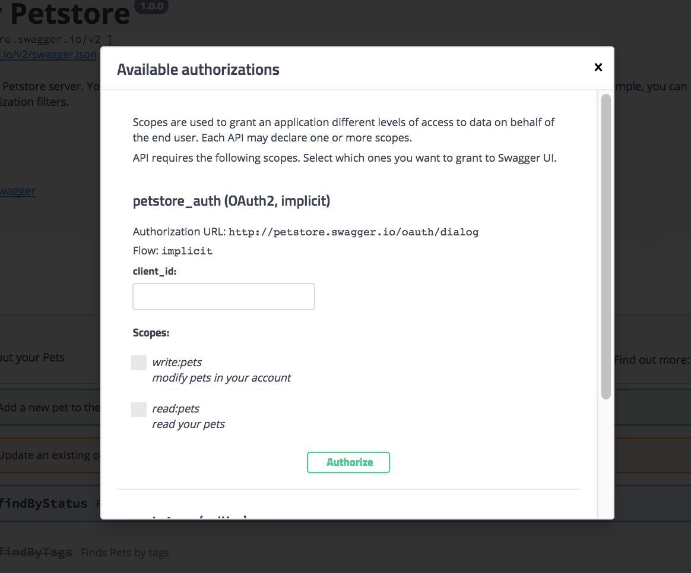

# Керівництво Swagger UI

[Swagger UI](https://github.com/swagger-api/swagger-ui) надає Фреймворк, який читає [специфікацію OpenAPI](https://github.com/OAI/OpenAPI-Specification). і створює веб-сторінку з інтерактивною документацією. У цьому керівництві показано, як інтегрувати документ специфікації OpenAPI в інтерфейс Swagger.


## Огляд Swagger UI

Swagger UI - один з найпопулярніших інструментів для створення інтерактивної документації. Swagger UI створює інтерактивну консоль API для експериментів із запитами в реальному часі. Крім того, Swagger UI підтримує останню версію специфікації OpenAPI (3.x) і інтегрується з іншими інструментами Swagger.


Перш ніж ми заглибимося в Swagger, потрібно прояснити ключові терміни.

#### Swagger

Відноситься до інструментів API, пов'язаним зі специфікацією OpenAPI. Деякими з цих інструментів є [Swagger Editor](https://swagger.io/tools/swagger-editor/), [Swagger UI](https://swagger.io/tools/swagger-ui/), [Swagger Codegen ](https://swagger.io/tools/swagger-codegen/), [SwaggerHub](https://app.swaggerhub.com/home) і [інші](https://swagger.io/tools/) . Всіма інструментами управляє компанія [Smartbear](https://smartbear.com/). Для отримання додаткової інформації див. [Інструменти Swagger](https://swagger.io/tools/). «Swagger» був спочатку оригінальною назвою специфікації OpenAPI, але пізніше ім'я було змінене на OpenAPI, щоб посилити відкритий, чи не ліцензійний характер стандарту. Люди іноді посилаються на обидва імені взаимозаменяемо (особливо на старих веб-сторінках), але «OpenAPI» - це те, як слід звертатися до специфікації. Додаткові відомості про різницю між OpenAPI і Swagger см. В розділі [ «У чому різниця між Swagger і OpenAPI?»](Https://swagger.io/blog/api-strategy/difference-between-swagger-and-openapi/) .

#### OpenAPI

Офіційна назва специфікації OpenAPI. Специфікація OpenAPI надає набір властивостей, які можна використовувати для опису REST API. Робочий, валідний документ можна використовувати для створення інтерактивної документації, створення клієнтських SDK, запуску модульних тестів і багато чого іншого. Подробиці специфікації можна вивчити на GitHub за адресою [https://github.com/OAI/OpenAPI-Specification](https://github.com/OAI/OpenAPI-Specification). В рамках ініціативи Open API з Linux Foundation специфікація OpenAPI спрямована на те, щоб бути незалежною від виробника (багато компаній беруть участь в її розробці).

#### Swagger Editor

[Онлайн-редактор](http://editor.swagger.io/#/), який перевіряє документацію OpenAPI на відповідність правилам специфікації OpenAPI. Редактор Swagger позначає помилки і дає поради щодо форматування.

#### Swagger UI

Веб-фреймворк ([на GitHub](https://github.com/swagger-api/swagger-ui)), який аналізує документ в специфікації OpenAPI і створює веб-сторінку інтерактивної документації. Swagger UI - це інструмент, який перетворює специфікацію в подібний [Petstore-сайт](http://petstore.swagger.io/).

#### Swagger Codegen

Генерує код SDK для безлічі різних платформ (таких як Java, JavaScript, Scala, Python, PHP, Ruby, Scala і інші). Код SDK допомагає розробникам інтегрувати API на конкретній платформі і забезпечує більш надійні реалізації, які можуть включати в себе більше масштабування, багатопоточності і т.д .. Загалом, SDK - це набори інструментів для реалізації запитів, зроблених за допомогою API. Swagger Codegen генерує клієнтські SDK практично на кожній мові програмування. Див. [Swagger Codegen](https://swagger.io/tools/swagger-codegen/) для отримання додаткової інформації.


## Знайомство зі Swagger за допомогою Petstore

Щоб краще зрозуміти інтерфейс Swagger, давайте розглянемо [приклад Swagger Petstore](http://petstore.swagger.io/). У прикладі Petstore сайт генерується за допомогою [Swagger UI](https://github.com/swagger-api/swagger-ui).


Кінцеві точки згруповані таким чином:

- [pet](http://petstore.swagger.io/#/pet)
- [store](http://petstore.swagger.io/#/store)
- [user](http://petstore.swagger.io/#/user)

### Авторизація запиту

Перш ніж робити які-небудь запити, потрібна авторизація. Натискаємо кнопку ** Authorize ** і заповнюємо інформацію, необхідну в вікні «Авторизація», зображеному нижче:



Приклад Petstore має модель безпеки OAuth 2.0. Код авторизації тільки для демонстраційних цілей. Немає ніякої реальної логіки авторизації цих запитів, тому просто закриваємо вікно Авторизации.


### Створення запиту

Тепер створимо запит:

1. Розгорнемо кінцеву точку [**POST Pet**](http://petstore.swagger.io/#/pet/addPet)
2. Натискаємо кнопку `Try it out`


Після того, як ми натиснемо кнопку `Try it out`, значення прикладу в поле« Тіло запиту »стане редагується.

3. В поле «Example Value» змінюємо перше значення `id` на випадкове ціле число, наприклад` 193844`. Також значення другого `name` на інше (ім'я вашого вихованця).
4. Натискаємо `Execute`


> Виконання прикладу запиту Petstore


Інтерфейс Swagger відправляє запит і показує відправлений [curl](../ like-developer / make-curl-call.md). Розділ Відповіді показує відповідь (Якщо вибрати JSON замість XML в списку «Response content type», формат відповіді буде показаний в форматі JSON.)


>! Важливо! Petstore - це функціонуючий API, і ви фактично створили вихованця. Тепер вам потрібно взяти на себе відповідальність за вашого вихованця і почати годувати і доглядати за ним! Жарти, жартами, але більшість користувачів не усвідомлюють, що грають з реальними даними, коли виконують відповіді в API (особливо при використанні свого власного ключа API). Ці тестові дані можуть бути чимось, що вам доведеться стерти при переході від досліджень і вивчення API до використання API для реального використання.


### Перевірка створення вихованця

1. Розвертаємо точку [GET /pet/{petId}](http://petstore.swagger.io/#/pet/getPetById)
2. Натискаємо кнопку `Try it out`
3. Вводимо ID вихованця, який використовували в попередньої операції. (Якщо забули ID, подивіться на кінцеву точку POST Pet, щоб перевірити значення.)
4. Натискаємо `Execute`. У відповіді ми повинні побачити ім'я нашого вихованця.


## Приклади сайтів з документацій із Swagger UI

Перш ніж ми перейдемо до іншого API з цим посібником по Swagger (крім демонстрації Petstore), подивимося на інші реалізації Swagger:

- [Reverb](https://reverb.com/swagger#/articles)
- [VocaDB](https://vocadb.net/swagger/ui/index)
- [Watson Developer Cloud](https://console.bluemix.net/developer/watson/documentation)
- [The Movie Database API](https://developers.themoviedb.org/3/account/get-account-details)
- [Zomato API](https://developers.zomato.com/documentation?lang=pl)

Деякі з цих сайтів виглядають однаково, але інші, такі як The Movie Database API і Zomato, були легко інтегровані в іншу частину їх сайту документації.

Дивлячись на приклади, можна помітити стислість документації в реалізації Swagger. Ця стислість пояснюється тим, що дисплей Swagger призначений для інтерактивної взаємодії, де можна випробувати виклики і подивитися відповіді - використовуючи свій власний ключ API, щоб побачити свої власні дані. такий підхід отримав назву: «вчися, практикуючись». Крім того, Swagger UI охоплює тільки адресні теми документації. Концептуальні розділи зазвичай розглядаються в окремому керівництві.


## Створення специфікації OpenAPI в Swagger UI

На цьому занятті ми створимо документацію в Swagger UI в специфікації OpenAPI. Якщо ви використовуєте один з попередньо створених файлів OpenAPI, ви можете побачити демонстрацію того, що ми створимо тут: [OpenWeatherMap Swagger UI](https://idratherbewriting.com/learnapidoc/assets/files/swagger/) або [Sunrise / sunset Swagger UI](https://idratherbewriting.com/learnapidoc/assets/files/swagger-sunrise-sunset/index.html)).


Для інтеграції специфікації OpenAPI в Swagger UI:

1. Готуємо дійсний документ специфікації OpenAPI:

 - Для використання попередньо створеного документа в специфікації OpenAPI, можна використовувати [файл специфікації OpenWeatherMap](https://idratherbewriting.com/learnapidoc/docs/rest_api_specifications/openapi_openweathermap.yml) або [файл специфікації Sunrise / sunset API](https: // idratherbewriting.com/learnapidoc/assets/files/swagger-sunrise-sunset/openapi_sunrise_sunset.yml) (Клік правою кнопкою миші посилання і збережіть файл YAML на робочому столі.)
2. Потрібно переконатися, що специфікація OpenAPI дійсна. Для цього вставляємо свій код специфікації OpenAPI в онлайн-редактор Swagger і бачимо, що зліва не відображаються жодні попередження. Права частина в редакторі Swagger показує повністю функціональний дисплей Swagger UI.
3. Переходимо в [проект Swagger UI на GitHub](https://github.com/swagger-api/swagger-ui)
4. Натисніть `Clone or download`, а потім натисніть` Download ZIP`. Завантажте файли в зручне місце на вашому комп'ютері і розпакуйте файли.

Єдина папка, з якої ми будемо працювати в завантаженому zip-архіві, - це папка dist (скорочення від дистрибутива). Все інше використовується, тільки якщо ми перекомпіліруя файли Swagger, що виходить за рамки цього керівництва.

5. витягти папку dist з папки swagger-ui-master в інший каталог. (Після цього папку swagger-ui-master і zip-файл можна видалити.)
6. Перетягнемо файл специфікації OpenAPI (з кроку 1) в папку dist. (Якщо ви використовуєте попередньо створені файли OpenAPI, файл називається або **openapi_openweathermap.yml**, або **openapi_sunrise_sunset.yml**.) Ваша файлова структура повинна виглядати наступним чином:

        ├── dist
        │   ├── favicon-16x16.png
        │   ├── favicon-32x32.png
        │   ├── index.html
        │   ├── oauth2-redirect.html
        │   ├── swagger-ui-bundle.js
        │   ├── swagger-ui-bundle.js.map
        │   ├── swagger-ui-standalone-preset.js
        │   ├── swagger-ui-standalone-preset.js.map
        │   ├── swagger-ui.css
        │   ├── swagger-ui.css.map
        │   ├── swagger-ui.js
        │   ├── swagger-ui.js.map
        │   ├── swagger30.yml
        │   └── [your openapi specification file]

7. У папці **dist** відкриваємо **index.html** в текстовому редакторі, такому як [Atom](https://atom.io/) або [Sublime Text](https: //www.sublimetext. com /).
8. Шукаємо наступний код:
         url: "http://petstore.swagger.io/v2/swagger.json",
9. Міняємо значення `url` на відносний шлях до вашого файлу YAML, а потім збережіть файл. наприклад

```
url: "openapi_openweathermap.yml",
```

або

```
url: "openapi_sunrise_sunset.yml",
```

10. Вивчимо файл index.html локально в браузері. Варто звернути увагу, що обмеження безпеки Chrome (заперечення CORS) не дозволяють переглядати файл Swagger UI локально. Але є кілька обхідних шляхів:
 - Перегляд файлу локально за допомогою [Firefox](https://www.mozilla.org/en-US/firefox/new/?v=c) (це найпростіший спосіб);
 - Використання розміщеного в Інтернеті URL-адреси [openapi_openweathermap.yml](https://idratherbewriting.com/learnapidoc/docs/rest_api_specifications/openapi_openweathermap.yml) або [openapi_sunrise_sunset.yml](https://idratherbewriting.com/learnapidoc/assets /files/swagger-sunrise-sunset/openapi_sunrise_sunset.yml). (Клік правою кнопкою миші посилання і виберіть «Копіювати адресу посилання».);
 - Завантаження папки ** dist ** на веб-сервер і перегляд її вмісту на сервері;
 - Помістити файл YAML в загальнодоступний [GitHub Gist](https://gist.github.com/) і потім натиснути `Raw`. Використовувати URL для цього Gist;
 - Використовувати локальний сервер, такий як [simple local HTTP server](https://developer.mozilla.org/en-US/docs/Learn/Common_questions/set_up_a_local_testing_server).

Коли файл Swagger UI буде готовий до публікації, просто завантажуємо папку на веб-сервер і переходимо в файл index.html. Наприклад, якщо назва каталогу dist залишилося без змін, переходимо за адресою http://myserver.com/dist/. (Ім'я папки **dist** можна міняти на будь-яке інше.)

> Для отримання додаткових інструкцій по роботі з Swagger UI см. [Документацію Swagger.io](https://swagger.io/docs/open-source-tools/swagger-ui/usage/installation/).


## Конфігурація параметрів Swagger UI

Swagger UI надає різні параметри конфігурації (не пов'язані з параметрами OpenAPI), які можна використовувати для налаштування інтерактивного дисплея. Наприклад, можна вказати, чи буде кожна кінцева точка розгорнута або згорнута, як будуть сортуватися теги і операції, показувати чи заголовки запитів у відповіді, чи включати розділ «Моделі» після списку кінцевих точок і багато іншого.

У цьому керівництві не будемо вдаватися в подробиці цих параметрів конфігурації.

Якщо подивитися на [код демонстрації призначеного для користувача інтерфейсу Swagger](https://idratherbewriting.com/learnapidoc/assets/files/swagger/) (перейдіть в View> Source), то побачимо параметри, перераховані в розділі `// Build a system` :

      // Build a system
    const ui = SwaggerUIBundle ({
      url: "openapi_openweathermap.yml",
      dom_id: '# swagger-ui',
      defaultModelsExpandDepth: -1,
      deepLinking: true,
      presets: [
        SwaggerUIBundle.presets.apis,
        SwaggerUIStandalonePreset
      ],
      plugins: [
        SwaggerUIBundle.plugins.DownloadUrl
      ],
      layout: "StandaloneLayout"
    })


Всі параметри (наприклад, `deepLinking`,` dom_id` і т. Д.) є значеннями за замовчуванням. Доданий `defaultModelsExpandDepth: -1`, щоб приховати розділ« Моделі »в нижній частині екрана Swagger UI.

Про параметри конфігурації Swagger UI можете дізнатися в [документації Swagger](https://swagger.io/docs/open-source-tools/swagger-ui/usage/configuration/).

## Проблеми Swagger UI

Вивчаючи інтерфейс Swagger, можна помітити кілька обмежень:

- Не так багато місця для докладного опису роботи кінцевих точок. При наявності декількох абзаців з подробицями і відомостями про параметр, найкраще посилатися з опису на іншу сторінку в документації. Специфікація OpenAPI надає спосіб посилання на зовнішню документацію як в об'єкті `paths`, так і в об'єкті` info`, а також і в об'єкті `externalDocs`.
- Інтерфейс Swagger виглядає практично однаково для кожного API. Можна [налаштувати Swagger UI](https://swagger.io/docs/open-source-tools/swagger-editor/#customization-36) під свої власні бренди, але знадобляться навички UX. Щодо легко змінити колір і зображення у верхній панелі навігації.
- Swagger UI може бути окремим сайтом від іншої документації. Це означає, що в своїй документації потрібно посилатися на Swagger в якості посилання для кінцевих точок. 


## Усунення несправностей

При налаштуванні Swagger UI, можуть виникати проблеми. Наступні проблеми є найбільш поширеними:

#### Проблема CORS

Якщо безпеку правильно налаштована, але запити відхиляються, це може бути пов'язано з проблемою CORS (cross-origin resource sharing). CORS - це міра безпеки, яку веб-сайти впроваджують, щоб інші сценарії і процеси не могли отримувати свій вміст через запити від віддалених серверів. Подробиці див. В розділі [ «Підтримка CORS»](https://github.com/swagger-api/swagger-ui#cors-support) в документації по інтерфейсу Swagger.

Якщо запити не працюють, переходимо в консоль JavaScript браузера (в Chrome, View> Developer> Javascript Console), робимо запит, і дивимося, чи стосується помилка до запитів різних джерел. Якщо це так, можна попросити розробників включити CORS на кінцевих точках.

#### Проблеми з url хоста

Хост тестового сервера може бути ще однією причиною відхилення запитів. Деякі API (наприклад, Aeris Weather) вимагають, створення ідентифікатор додатки на основі URL-адреси хоста, на якому будуть виконуватися запити. Якщо зареєстрованим URL-адресою хоста є [`http: // mysite.com`](http://mysite.com/), але тест відправляється за адресою [` https://editor.swagger.io/`](https : //editor.swagger.io/), сервер API відхилить запити.


## Вбудовування Swagger UI в існуючий сайт

Крім публікації вихідних даних для користувача інтерфейсу Swagger в якості окремого сайту, можна вбудовувати файл Swagger в існуючий сайт. Опис можна подивитися тут:

- [Standalone Swagger UI Demo](https://idratherbewriting.com/learnapidoc/assets/files/swagger/)

Swagger UI адаптивен і добре масштабується, що дозволяє вписати його практично в будь-який простір. Проте, вбудований в існуючий сайт Swagger виглядає як сайт всередині сайту.
